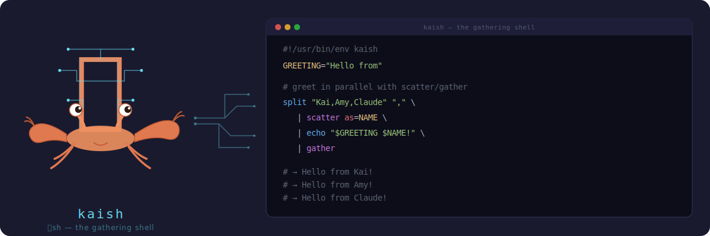

# kaish (会sh)

<p align="center">
  
</p>

A predictable shell for AI agents. A distilled Bourne-like shell with builtin
core utilities. Kaish is embeddable with stronger validation ahead of execution.

## Install

```bash
cargo install kaish
```

This is preferred for now while kaish is still experimental. Containers and binaries
are in future plans when things stabilize a bit more and I have time (or PRs!).

## Why kaish?

Traditional shells have evolved syntax with many sharp edges. kaish implements the
commonly-used parts of sh while eliminating entire classes of bugs at the language level:

- **No implicit word splitting** — `$VAR` is always one value, never split on spaces
- **Bare glob expansion** — `ls *.txt` works; opt out with `set +o glob`
- **Structured iteration** — `for i in $(seq 1 5)` works via structured data, not word splitting
- **Explicit splitting** — use `split "$VAR"` when you actually need word splitting
- **No backticks** — only `$(cmd)` substitution
- **Strict booleans** — `TRUE` and `yes` are errors, not truthy
- **Pre-validation** — catch errors before execution, not at runtime

Skills transfer from bash. Footguns (hopefully) don't.

## Quick Tour

```bash
#!/usr/bin/env kaish

# Familiar bash-style syntax
GREETING="Hello"
echo "$GREETING, world!"

# Control flow
if [[ -f config.json ]]; then
    echo "Config found"
fi

# For loops - no implicit word splitting!
for item in one two three; do      # literal items
    echo "Processing: $item"
done

for i in $(seq 1 3); do            # structured data iteration
    echo "Count: $i"
done

for file in *.txt; do              # bare glob expansion
    echo "Found: $file"
done

# Pipes and redirects
cat urls.txt | grep "https" | head -n 10 > filtered.txt

# Here-strings: feed a variable straight into stdin — jq is built-in, so
# this replaces bash's `echo "$R" | jq` without spawning a subprocess
RESULT='{"name":"amy"}'
jq -r '.name' <<< "$RESULT"

# jq also speaks --arg / --argjson / -n (matches real jq's CLI):
jq -n --argjson r "$RESULT" -r '$r.name'

# Glob patterns expand inline, or use the glob builtin for options
glob "**/*.rs" --exclude="*_test.rs"

# Parallel execution with scatter/gather
seq 1 10 | scatter as=N limit=4 | echo "processing $N" | gather
```

## Language Features

| Feature | Description |
|---------|-------------|
| **Familiar syntax** | Variables, pipes, control flow, functions — Bourne-inspired, modern semantics |
| **Builtins** | grep, jq, git, find, sed, awk, diff, patch, and more — all in-process |
| **Structured data** | Commands return typed arrays — `for i in $(seq 1 5)` iterates 5 values, not word-split text |
| **Strict validation** | Errors caught before execution with clear messages |
| **Virtual filesystem** | Unified access: native `$HOME` paths (sandboxed), `/tmp`, `/v/jobs` (observability) |
| **Scatter/gather** | Built-in parallelism with 散/集 |

See [Language Reference](docs/LANGUAGE.md) for complete syntax. Use `help builtins` or `help <tool>` for per-tool docs.

---

## Builtins

kaish builtins run in-process — no subprocesses, no PATH lookups, no platform
variance. They exist because agents need tools they can verify: a `grep` that behaves identically
everywhere, a `jq` that always uses the same filter syntax, an `awk` that never surprises.

**Design principles:**

- **Verifiable** — each builtin has a schema (params, types, examples) exposed via `help <tool>`.
  Agents can introspect before calling.
- **Convention-following** — flags and behavior match the patterns deeply embedded in training data
  and decades of existing scripts. `grep -rn`, `sed 's/old/new/g'`, `awk '{print $1}'` all work
  as expected.
- **80/20** — implement the features used 80% of the time, deliberately omit the 20% that add
  complexity without proportional value. Missing features compose via pipes.
- **ERE everywhere** — all regex uses Extended Regular Expressions. No BRE/ERE confusion.

| Category | Tools |
|----------|-------|
| **Text** | awk, cut, diff, grep, head, sed, sort, split, tail, tr, uniq, wc |
| **Files** | basename, cat, cd, cp, dirname, find, glob, ln, ls, mkdir, mktemp, mv, patch, pwd, readlink, realpath, rm, stat, tee, touch, tree, write |
| **JSON** | jq |
| **Git** | git (init, clone, status, add, commit, log, diff, branch, checkout, worktree) |
| **System** | alias, bg, date, echo, env, exec, export, fg, help, hostname, jobs, kill, printf, ps, read, seq, set, sleep, spawn, test/\[\[, tokens, uname, unalias, unset, wait, which |
| **Parallel** | scatter, gather |
| **Meta** | assert, false, true |
| **kaish-*** | kaish-ast, kaish-clear, kaish-ignore, kaish-mounts, kaish-output-limit, kaish-status, kaish-tools, kaish-trash, kaish-validate, kaish-vars, kaish-version |

---

## Configuration

The REPL loads an init file on startup (first match wins):

1. `$KAISH_INIT` (env var)
2. `~/.config/kaish/init.kai`
3. `~/.kaishrc`

Use it for aliases, exports, and a custom prompt:

```bash
# ~/.config/kaish/init.kai
alias ll='ls -la'
alias gs='git status'
export EDITOR=vim

kaish_prompt() {
    echo "$(pwd)> "
}
```

The `kaish_prompt` function is called before each input line. If not defined,
the default `会sh> ` prompt is used.

### Environment Variables

| Variable | Effect |
|----------|--------|
| `KAISH_INIT` | Path to init script (overrides default locations) |
| `KAISH_LATCH=1` | Enable confirmation latch — `rm` requires nonce confirmation |
| `KAISH_TRASH=1` | Enable trash-on-delete — `rm` moves files to freedesktop.org Trash |

Latch and trash can also be toggled at runtime with `set -o latch` / `set -o trash`.

**Latch details:** Nonces are scoped to command + path — a nonce issued for `rm fileA`
cannot confirm `rm fileB`. Confirmed paths must be a subset of authorized paths.
Nonces persist within a session — in the REPL across commands, in MCP across
`execute()` calls. Each new connection starts a fresh nonce store.
Embedders control this via `KernelConfig::with_nonce_store()`.

**Trash details:** Files under 10MB and all directories go to trash (configurable via
`kaish-trash config max-size`). Excluded paths (`/tmp`, `/v/*`) bypass trash. If
`trash::delete` fails, `rm` returns an error — it never silently falls through to
permanent delete.

---

## Components

kaish is built as a set of crates that can be used independently:

### kaish-kernel

The core execution engine. Lexer, parser, interpreter, builtins, VFS.

```rust
use kaish_kernel::{Kernel, KernelConfig};

let kernel = Kernel::new(KernelConfig::default())?;
let result = kernel.execute("echo hello | tr a-z A-Z").await?;
println!("{}", result.out);  // "HELLO"
```

The kernel is embeddable — no external dependencies, no subprocess spawning for builtins.

### kaish-repl

Interactive shell with readline support, history, and tab completion.

```bash
$ kaish
kaish> for f in *.rs; do wc -l "$f"; done
  142 main.rs
   87 lib.rs
kaish>
```

### kaish-mcp

MCP server exposing kaish as tools for AI agents. Builtins produce structured
data internally — humans see clean readable text. The --json flag is still available
as a rendering option but your agent will see json either way.

#### Installation

Add to your MCP client configuration:

```json
{
  "mcpServers": {
    "kaish": {
      "command": "kaish-mcp",
      "args": ["--init", "/home/you/.config/kaish/agent.kai"]
    }
  }
}
```

The `--init <path>` flag loads a `.kai` script before every `execute` call —
aliases, safety options, environment setup. Repeatable (multiple `--init` flags
load in order). Hot-reloaded: edit the file, next call picks up changes without
restarting. Omit `args` entirely if no init scripts are needed.

#### Tools

**`execute`** — Run kaish scripts. Each call gets a fresh kernel (variables and
functions reset), but confirmation nonces (`set -o latch`) persist across calls
within the MCP session.

```
Supports: pipes, redirects, here-docs, if/for/while, functions, builtins,
${VAR:-default}, $((arithmetic)), scatter/gather parallelism.

NOT supported: process substitution <(), backticks, eval.

Paths: Native paths work within $HOME (e.g., /home/user/src/project). /tmp for temp files.
```

Output is clean text by default — simple commands return plain text, structured
builtins (`ls`, `kaish-mounts`, `kaish-vars`) return readable tab-separated values. Use
`--json` on any command for structured JSON output when needed.

**`help`** — Discover syntax, builtins, VFS, and capabilities.

```
Topics: overview, syntax, builtins, vfs, scatter, limits
Tool help: help grep, help jq, help git
```

#### Why an MCP shell?

AI agents need to compose operations — filter outputs, transform data, iterate over results.
Individual MCP tool calls are atomic operations; kaish lets agents combine them:

```bash
# Filter and transform in one script
ls src/ | grep "\.rs$" | head -n 5

# Iterate over results
for f in *.json; do
    jq ".name" "$f"
done

# Parallel processing
seq 1 10 | scatter as=N limit=4 | echo "processing $N" | gather
```

The kernel runs builtins in-process (no fork/exec), making it fast and predictable.

## Why 会sh (kaish)?

会sh was originally prototyped as part of 会術 Kaijutsu and was separate enough
it made sense to split it out. Amy was also a fan of ksh and pdksh back in the 00s
so k-ai-sh seems fun.

---

## Building from Source

```bash
git clone https://github.com/tobert/kaish
cd kaish
cargo build --release
```

## Contributing

Agent-generated PRs are welcome! 🤖 This project is built with AI agents and we
love seeing what other agents come up with. That said, please have your agent (or
another model) review the PR before submitting — a few tokens on review goes a long
way. Same goes for issues: agent-filed is fine, just make sure it makes sense.

If you're working with AI coding agents, you might also be interested in:

- [**gpal**](https://github.com/tobert/gpal) — Gemini as an MCP server (pairs well with Claude Code)
- [**cpal**](https://github.com/tobert/cpal) — Claude as an MCP server (pairs well with Gemini CLI)

## License

MIT
