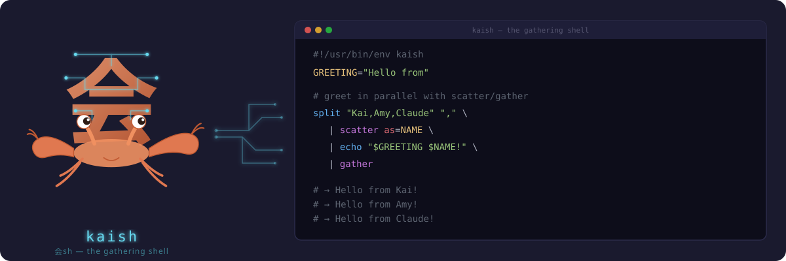

# kaish (会sh)

[](https://github.com/tobert/kaish/actions/workflows/ci.yml)
[](https://crates.io/crates/kaish-kernel)

<p align="center">
  
</p>

**kaish** is a predictable shell for AI agents delivered as an embeddable Rust
library with a reference REPL. The language is inspired by POSIX `sh` and bash
and informed by ShellCheck's lints. What it keeps is `sh`-shaped, so most muscle
memory and model training transfers. What it drops — word splitting, `eval`,
backticks, process substitution — is the part that makes shell unpredictable.
Typed data is added on top.

The builtins — grep, sed, awk, find, and ninety-odd more — run in-process, so most
text processing never needs `fork()` or `exec()`. All file I/O goes through a
virtual filesystem that can pass through, stay in memory, or overlay the two.
An embedded kaish gives an agent a complete scripting environment that can be
constrained naturally.

**Status:** pre-1.0 (current version on the badge above). The language has
settled; what remains before 1.0 is ergonomics and correctness polish.
Everything ships through [CHANGELOG.md](CHANGELOG.md).

**Try it now:** [tobert.github.io/kaish-extras](https://tobert.github.io/kaish-extras/) —
the kernel compiled to wasm, running entirely in your browser tab. No install,
no server; the playground is seeded with kaish's own source so you can `grep`
the shell's implementation from inside the shell.

## Why a shell for agents?

Agents need to compose operations such as filtering output, transforming data,
and iterating over results. They are already good at Bourne shell idioms, and
shell is already an ideal language for text processing. kaish inherits all of
that, so piping, redirecting, and composing commands works like it always has,
with just a couple changes.

```sh
# Filter and transform in one script
ls src/ | grep "\.rs$" | head -n 5

# Iterate over results
for f in *.log; do
    wc -l "$f"
done

# Parallel processing with bounded concurrency
seq 1 10 | scatter --as N --limit 4 | echo "processing $N" | gather
```

Handing an agent `bash -c` is dangerous on many levels. It comes with
word-splitting surprises, tools that vary by platform and version, and full host
access by default. kaish keeps the language the models already know and swaps out
the implementation: strict parsing with pre-execution validation, builtins that
behave identically everywhere, and a filesystem boundary the embedder controls.

Underneath, kaish's data model is JSON. A variable holds an array or a record as
naturally as a string, `$(cmd)` substitution carries structured values, so you
can choose between old-school text parsing and using JSON-typed data. Using the
`--json` flag on any command will get it to emit the same typed data the
language works with internally. Structured results flow through pipes,
subscripts, and iteration without extra serialization / deserialization steps.

## What's Different About kaish?

Kaish is sh-like but not a full Bourne shell or bash. The idea is to preserve the
language that's comes naturally, while providing better pre-execution
syntax checking, easy embedding, and a VFS abstraction to help with sandboxing.

- **JSON data model** — kaish's native values are JSON types: strings, numbers, booleans, arrays, and records.
- **Single brackets are JSON** - `[` is for json arrays and records, `[[` is for branching
- **No implicit word splitting** — `$VAR` is always one value, never split on spaces
- **Line iteration in for-loops** — `for line in $(cat file)` splits on `\n` only; whitespace within a line is never split
- **Structured iteration** — `for i in $(seq 1 5)` works via structured data, not word splitting
- **Explicit splitting** — use `split "$VAR"` for whitespace/delimiter/regex splitting
- **No backticks** — only `$(cmd)` substitution
- **Strict booleans** — `TRUE` and `yes` are errors, not truthy
- **Pre-validation** — validation stretches down into builtins, revealing errors before execution

## Quick Tour

```sh
#!/usr/bin/env kaish

GREETING="Hello"
echo "$GREETING, world!"

# control flow with [[ works just like bash
if [[ -f config.json ]]; then
    echo "Config found"
fi

# regular *.log works but glob adds modern affordances and its
# data passes to the for loop as a JSON array
for file in $(glob **/*.log); do
    echo "logfile: $file"
done

# quote to join: adjacent unquoted tokens never paste together
echo "$GREETING/world.txt"          # ✅  quote the whole word
# echo $GREETING/world.txt          # ❌  parse error — kaish won't paste $GREETING and /world.txt

# pipes and redirects
cat urls.txt | grep "https" | head -n 10 > filtered.txt

# the data model is JSON: parse text into typed collections, index directly
CONFIG='{"name":"amy","langs":["rust","kaish"]}'
C=$(fromjson <<< "$CONFIG")
echo "${C[name]} writes ${C[langs][0]}"      # amy writes rust

SERVERS=$(fromjson <<< '{"web1":"10.0.0.1","web2":"10.0.0.2"}')
for host in $(keys $SERVERS); do
    echo "$host -> ${SERVERS[$host]}"
done

# glob patterns expand inline, or use the glob builtin for options
glob "**/*.rs" --exclude="*_test.rs"

# parallel execution with scatter/gather — --as N binds $N in each worker;
# --limit caps concurrency; gather emits one JSONL record per worker
seq 1 10 | scatter --as N --limit 4 | echo "processing $N" | gather
```

See [docs/LANGUAGE.md](docs/LANGUAGE.md) for the complete language reference, or
ask kaish itself — help is in-band: `help builtins`, `help syntax`, `help <tool>`.

## Getting Started

You'll need a Rust toolchain ([rustup](https://rustup.rs)). For

### The REPL

```sh
cargo install kaish-repl    # installs a binary named `kaish`
```

```
$ kaish
会sh> for f in *.rs; do wc -l "$f"; done
  142 main.rs
   87 lib.rs
会sh>
```

The REPL loads an init file on startup — the first match of `$KAISH_INIT`,
`~/.config/kaish/init.kai`, `~/.kaishrc` — for aliases, exports, and a custom
prompt. Define `kaish_prompt` and it's called before each input line:

```sh
# ~/.config/kaish/init.kai
alias ll='ls -la'
alias gs='git status'
export EDITOR=vim

kaish_prompt() {
    echo "$(pwd)> "
}
```

### Embedding the kernel

Construct a `Kernel`, point it at a sandbox root, call `execute()`:

```toml
[dependencies]
kaish-kernel = "0.13"
tokio = { version = "1", features = ["full"] }
```

```rust
use kaish_kernel::{Kernel, KernelConfig, VfsMountMode};
use std::path::PathBuf;

#[tokio::main]
async fn main() -> anyhow::Result<()> {
    // Sandboxed to one directory. The default build can't spawn processes
    // at all — external commands are an opt-in cargo feature (`subprocess`).
    let config = KernelConfig::named("my-agent")
        .with_vfs_mode(VfsMountMode::Sandboxed {
            root: Some(PathBuf::from("/path/to/workspace")),
        })
        .with_cwd(PathBuf::from("/path/to/workspace"));
    let kernel = Kernel::new(config)?;

    let result = kernel.execute(r#"ls | grep '\.rs$' | head -n 3"#).await?;
    if result.code != 0 {
        eprintln!("script failed: {}", result.err);
    }
    println!("{}", result.text_out());
    Ok(())
}
```

The kernel is hermetic by default — it never reads the OS environment (the
frontend supplies vars), and the OS-touching capability features (`subprocess`,
`host`, `os-integration`, `tokens`) are opt-in cargo features, so the dangerous
surface is named, not inherited. Every `execute()` returns an `ExecResult` with
clean text output, an optional typed `data` payload (`--json` on any command),
and an exit code agents can branch on: `2` means a destructive op wants
confirmation, `3` means output was truncated, `124` is a timeout.

[docs/EMBEDDING.md](docs/EMBEDDING.md) is the full guide: kernel construction,
capability features, `ExecuteOptions`, custom tools, the exit-code contract, and
thread stack sizing.

**Using kaish over MCP?** kaish core doesn't ship an MCP server — that surface
lives in the embedders. [**kaibo**](https://github.com/tobert/kaibo) (解剖) is the
showcase: a read-only codebase-analysis MCP that drives kaish to read and reason
about a project and answers with cited `file:line` spans.
[**kaijutsu**](https://github.com/tobert/kaijutsu) embeds kaish behind its own MCP
interface too. Both show the pattern: embed the kernel, then expose it however
your agent needs.

**Not embedding, just curious?** [**kaish-extras**](https://github.com/tobert/kaish-extras)
compiles the kernel to `wasm32-unknown-unknown` and runs it in a browser tab —
try it at [tobert.github.io/kaish-extras](https://tobert.github.io/kaish-extras/).

## Builtins

kaish builtins run in-process — no subprocesses, no PATH lookups, no platform
variance. They exist because agents need tools they can verify: a `grep` that
behaves identically everywhere, a `sed` whose dialect doesn't depend on the host,
an `awk` that never surprises.

**Design principles:**

- **Verifiable** — each builtin has a schema (params, types, examples) exposed via `help <tool>`.
  Agents can introspect before calling.
- **Convention-following** — flags and behavior match the patterns deeply embedded in training data
  and decades of existing scripts. `grep -rn`, `sed 's/old/new/g'`, `awk '{print $1}'` all work
  as expected.
- **80/20** — implement the features used 80% of the time, deliberately omit the 20% that add
  complexity without proportional value. Missing features compose via pipes.
- **ERE-first regex** — Extended Regular Expressions are the dialect everywhere; common GNU BRE
  spellings (`\|`, `\(…\)`, `\{n,m\}`, `\+`, `\?`) are accepted too and rewrite to ERE, so existing
  scripts keep working. `-E`/`-r` opts into strict ERE.

| Category | Tools |
|----------|-------|
| **Text** | awk, base64, cut, diff, grep, head, sed, sort, split, tac, tail, tr, uniq, wc, xxd |
| **Files** | basename, cat, cd, checksum, cmp, cp, dd, dirname, file, find, glob, ln, ls, mkdir, mktemp, mv, patch, pwd, readlink, realpath, rm, stat, tee, touch, tree, write |
| **JSON** | fromjson, fromjsonl, jq, keys, tojson, tojsonl, typeof, values |
| **System** | alias, approvals, bg, date, echo, env, exec, export, fg, help, hostname, jobs, kill, printf, ps, push, read, seq, set, sleep, spawn, timeout, tokens, uname, unalias, unset, wait, which |
| **Parallel** | scatter, gather |
| **Meta** | assert, false, test, true |
| **kaish-*** | kaish-ast, kaish-clear, kaish-ignore, kaish-last, kaish-mounts, kaish-output-limit, kaish-status, kaish-tools, kaish-trash, kaish-validate, kaish-vars, kaish-version, kaish-vfs |

## Safety rails

- Builtins go through the VFS and see only its mounts — the agent preset
  sandboxes to `$HOME` + `/tmp`, with `/v/` as in-memory scratch under a
  64 MiB budget.
- **External commands resolved via `PATH` run against the real filesystem** —
  the VFS sandbox does not apply to them. Block them at runtime with
  `allow_external_commands=false`, or build without the `subprocess` capability
  feature and they don't exist at all.
- `--overlay` makes a call copy-on-write: writes stay in memory unless the
  script runs `kaish-vfs commit`.
- `set -o approvals` (or `KAISH_APPROVALS=1`) gates destructive commands behind
  an approval — the command returns exit 2 and a typed request naming the
  operation and the paths, instead of acting. At an interactive terminal the
  REPL asks and runs the command on `y`; a piped or captured session is never
  asked and gets the exit-2 request. `kaish --gate <cmd[,cmd...]>` widens what
  asks to every statement planning one of those commands.
- `set -o trash` (or `KAISH_TRASH=1`) diverts deletes to the freedesktop.org
  Trash instead of removing them. Trash wins over approvals: a delete the trash
  can catch needs no approval, because the trash IS the recovery net.

Approvals and trash semantics are covered in [docs/LANGUAGE.md](docs/LANGUAGE.md);
the embedder-facing contract (`ExecResult.approval`, `ApproverHandle`,
`Kernel::confirm`) in [docs/EMBEDDING.md](docs/EMBEDDING.md).

## Terms

kaish uses these words with one meaning each, in the docs, the help system, and the
error messages.

| Term | Meaning |
|---|---|
| loud, fail loud | An error is explicit and immediate. kaish never continues on a wrong assumption. |
| silently | Used only in the negative, to name behavior kaish refuses. |
| builtin | A tool that runs inside the kernel process. |
| external command | A program the kernel runs through `PATH`. |
| kernel | The execution core. Not the OS kernel. |
| mount | A path prefix bound to a filesystem, or the act of binding one. |
| typed | A value keeps its JSON type through substitution. It is not stringified. |
| overlay | Copy-on-write mode. Writes land in a virtual upper layer until committed. |
| trash | Recoverable deletion under `set -o trash`. A trash failure is an error, never a permanent delete. |
| request | One privileged operation asking to proceed. It does not run until a matching grant exists. |
| grant | One decision to allow a request, or the act of making it. A grant authorizes exactly one *successful* run; a failed attempt does not consume it. |
| key | The credential that redeems one request — what `--confirm=<token>` carries. The kernel holds it: no public type has a field for it, and only an approval authority can retrieve it. |
| attempt | One execution reserved against a grant, with its own outcome. "The operation ran" is a fact about an attempt, never about a request. |
| spill | To write oversize output to a file, or the file that results. |
| escape hatch | A documented, supported way past a restriction kaish enforces — `-E` out of the BRE superset, `--lines` out of JSONL rows, single quotes out of expansion. Never a workaround: an escape hatch is part of the design, and every restriction that has one names it. |

Contributors: the writing style behind this vocabulary is in
[docs/style.md](docs/style.md).

## Why build 会sh?

会sh (kaish) was originally prototyped as part of 会術 Kaijutsu and was separate enough
it made sense to split it out. Amy was also a fan of ksh and pdksh back in the 00s
so k-ai-sh seemed fun. kaish is now also used by [kaibo](https://github.com/tobert/kaibo)
to provide agents with a read-only shell.

## Building from Source

```sh
git clone https://github.com/tobert/kaish
cd kaish
cargo build --release
cargo test --all
cargo clippy --all --all-targets   # must be warning-free
```

CI runs the test and clippy gates on every PR and push to `main` — plus a
no-default-features check of the kernel (the capability-feature sandbox) and a
`wasm32-wasip1` build of `kaish-wasi`. See
[`.github/workflows/ci.yml`](.github/workflows/ci.yml); releases to crates.io
are cut manually, so that one workflow is the whole CI story.

## Contributing

Agent-generated PRs are welcome! 🤖 This project is built with AI agents and we
love seeing what other agents come up with. **All changes go through a PR** —
branch, push, and open a PR rather than committing to `main` (releases are the
exception). That said, please have your agent (or another model) review the PR
before submitting — a few tokens on review goes a long way. Same goes for issues:
agent-filed is fine, just make sure it makes sense. CI must be green before a PR
merges; note that the runners track current stable Rust, so clippy there may know
lints your local toolchain doesn't yet.

If you're working with AI coding agents, you might also be interested in
[kaibo](https://github.com/tobert/kaibo), an assistant for you assistant with a
read-only kaish shell.

- [**gpal**](https://github.com/tobert/gpal) — Gemini as an MCP server (pairs well with Claude Code)
- [**cpal**](https://github.com/tobert/cpal) — Claude as an MCP server (pairs well with Gemini CLI)

## License

MIT
