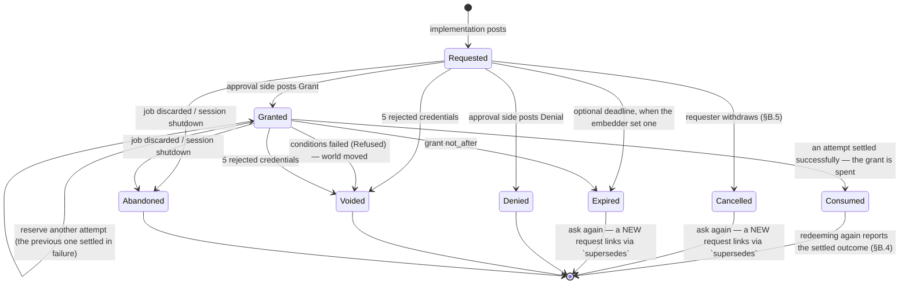
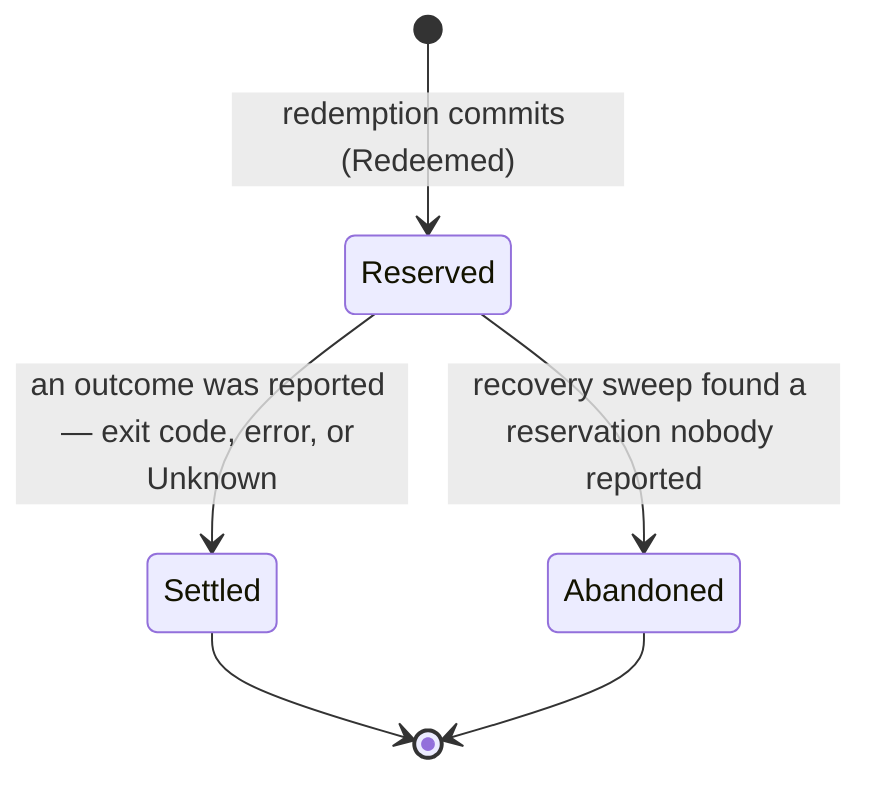

# The kaish approval ledger

**Status:** living design doc — spec current as of 2026-08-10. Every lane in §H has landed:
the ledger core, the latch cutover, the statement gate, the five rework lanes, and the REPL
that fulfils its own gates. §I carries what is still open.
This file in kaish `docs/` is the canonical copy (migrated from kaish-extras 2026-08-01;
the extras copy is superseded).
**Target:** kaish kernel (post-0.13) · **Motivating embedder:** kaijutsu · **First in-kernel consumer:** kaish-git's write profile
**Inputs:** [safety-inventory](https://github.com/tobert/kaish-extras/blob/main/docs/design/safety-inventory-2026-08.md) (problem statement), [kaish-extras git.md](https://github.com/tobert/kaish-extras/blob/main/docs/git.md) §7 (first consumer)
**Reviews:** [gemini-pro](https://github.com/tobert/kaish-extras/blob/main/docs/design/reviews/ledger-review-gemini-2026-08.md), [gpt-sol](https://github.com/tobert/kaish-extras/blob/main/docs/design/reviews/ledger-review-gpt-2026-08.md)
**Supersedes:** the confirmation latch, which is deleted outright (see §F)

### History

Drafted 2026-08-01 by an Opus design agent from the safety inventory. Cross-model
reviewed the same day against the real tree by gemini-pro and gpt-sol (linked above);
their findings — first-class attempts, one linearization rule, drop-safe settlement, a
structurally tokenless public view, replay correlation — are folded into the spec below
rather than kept as a separate revision list. Migrated from kaish-extras to kaish `docs/`
on 2026-08-01 because this is a kernel feature and the design belongs with the kernel.
Key decisions by Amy, 2026-08-01: delete the latch with no compatibility layer, keep the
key path free of special cases, wire kaijutsu first, make `fs.*` observability an opt-in
subscription. A second cross-model consistency review followed the redraft; its findings
and Amy's 2026-08-02 rulings — pure bearer keys, one successful settlement per grant,
double-click-friendly `RequestId`s, `confirm` on the kernel with the handle as an argument —
are folded in the same way. The first hardening PR (CSPRNG tokens) landed as kaish #259 on
2026-08-02.

**The decision archaeology lives in `git log docs/approval-ledger.md`** — the original
draft, the review synthesis, the correction layers, and the conversations behind each
ruling. This body carries the settled design and nothing else; where it disagrees with an
earlier revision, this body wins.

---

## 0. The one-paragraph version

Every privileged operation in kaish posts a **request** to an append-only ledger and does
not run until a matching **authorization** exists. The implementation side has exactly one
call — `ctx.request_approval(req)` — and never learns whether the grant came from a human
at a terminal, a standing policy rule, or an embedder's hook. Only the approval side can
grant, and it grants by posting its own entry. The ledger is consistent when every
execution attempt has exactly one live grant behind it and exactly one settlement in front
of it. Nothing is cryptographic: the ledger buys *correctness under concurrency, a
readable record afterward, and a state machine whose illegal transitions are loud*, not
tamper-evidence. Every ledger append is also a tracing event or span, at the same call
site, so the audit story and the OTel story are one story.

The confirmation latch is deleted and its behavior is re-expressed on the ledger: one
operation class (`fs.*`), one policy ("ask the human"), the same `--confirm=<token>` UX,
the same exit code 2.

## 0.1 Mechanism, not policy — the line this design holds

> **The kernel owns the mechanism, the invariants, and the audit record. The embedder owns
> the policy.**

The kernel's half is the part that must be correct under concurrency and identical for
everyone: the balance rule (one grant, one successful settlement), the state machine and
its loud illegal transitions, the append-only record and its timestamps, the seams where a
decision is asked for, and the types that make a bypass unrepresentable. The embedder's
half is every question whose right answer differs per deployment: how long an unanswered
request should live, what counts as a secret, what a classifier believes, when to escalate
to a human, and **who waits for the answer**.

Three consequences are load-bearing enough to state as rules, because they read as absences
otherwise and someone will eventually try to fix them back:

**The kernel stamps records with when things happened. The kernel never reads a clock to
decide anything.** Every entry carries `at: SystemTime` — an audit log without timestamps
is not an audit log. But no *decision* consults a clock: there is no request TTL, no
expiry sweep, and no staleness deadline on an attempt. A request lives until it is decided
or cancelled. The grant's `not_after` is the sole exception and is not a counter-example:
it is a value the approval side *sets*, compared once at redemption, never a deadline the
ledger wakes up to enforce. See §A.10 for why, and §B.5 for what replaced expiry.

**The kernel never waits on the embedder.** A decision the kernel cannot make itself is
returned as data — `ApprovalOutcome::Pending`, carrying the request view and a structured
`ResumeAction` — and the embedder comes back when it has an answer. There is no hook the
kernel awaits, because both ways of awaiting one are wrong: a bounded wait is a
clock-driven decision, which the rule above already forbids, and an unbounded wait is a
liveness hazard the kernel cannot cancel on anyone's behalf correctly. This is the same
distinction the design draws everywhere else, applied to control flow — the kernel *asks*
for policy with a pure function on the request path (`Policy::evaluate`), and it *returns*
anything that cannot be answered immediately. It never runs the embedder's deliberation
inside its own task, on its own clock, under its own cancellation. See §C.2 for the chain
this produces and §C.1 for what comes back.

**The kernel redacts exactly one thing: its own key.** It can do that exactly, with no
heuristics, because it minted the credential and knows the string. It does not detect
credentials in general — no flag-name lists, no URL-userinfo parsing, no entropy scoring.
A shell cannot win that game and a spec that promises best-effort secret detection has
made a guarantee it cannot keep. What the kernel provides instead is one redaction
point every sink passes through and the `PlannedValue` vocabulary — embedder-defined
redaction is an embedder-side pass over the plans and records the embedder holds. See §A.8.

The same line resolves the rest of this design: the kernel supplies the classifier's input
wrapper and the rule that a classifier error means `Gate` (§C.6), and the embedder supplies
the classifier; the kernel supplies an append-only recorder for assessments (§C.7), and the
embedder supplies the assessors. Where this document says the kernel does not do something,
it is this line being held, not an omission.

### Vocabulary

The ledger replaces the latch's words along with its code. These are the terms this
document uses; it does not use synonyms for them.

| Term | Meaning |
|---|---|
| **ledger** | The append-only log of approval facts plus the live state it indexes. One per kernel process (§B.1). |
| **request** | One privileged operation asking to proceed. Posted by the implementation side. |
| **grant** | One decision to allow a request. Posted by the approval side. Carries expiry and conditions, and authorizes exactly one *successful* settlement (§A.1). |
| **name** (`RequestId`) | The request's public identifier. Everything except redemption works by name (§A.2). |
| **key** (`Token`) | The redemption credential. A pure bearer credential: kernel-held, never a field of any public type, retrievable only through an `ApproverHandle`, and good for whoever presents it (§A.2, §E.1). |
| **attempt** | One execution reserved against a grant. Has its own id and its own terminal outcome (§A.1). |
| **redeem** | To reserve an attempt, by presenting a key or an internal redemption context. |
| **settle** | To record an attempt's outcome. Idempotent by `AttemptId`. |
| **standing grant** | A rule that auto-grants matching future requests, and is itself a ledger entry (§C.4). |
| **subscription** | A glob-scoped registration making matching operations `observe` (record only) or `enforce` (decide) — §C.5. |
| **authority** | Holding an `ApproverHandle`: the capability to grant, deny, revoke, and retrieve a key. |
| **scope** | Which kernel, session, and actor a request belongs to (`ApprovalScope`, §A.7). Every request carries one; handles derive scoped views from it. |
| **binding** | The context a grant was decided against — plan digest, cwd, scope, sandbox profile (`PlanBinding`, §A.9). A replay outside its binding is a new request, not a redemption. |
| **assessment** | One attributed judgment recorded on the way to a decision — a classifier's, a specialist's, a human's (§C.7). Assessments explain a decision; they are not themselves decisions. |
| **cancel** | To close an undecided request from the requesting side (§B.5). What replaced expiry: the kernel does not time a request out, so something must be able to end one. |
| **pending** | A request the kernel has returned to the caller undecided (`ApprovalOutcome::Pending`). The normal outcome for anything that has to be thought about — the kernel does not wait (§0.1, §C.2). |
| **resume** | To pick a pending request back up once it is decided, by the route `ResumeAction` names: re-run the statement with the key, or `Kernel::confirm` the captured invocation (§C.1, §B.4). |

**`latch` and `nonce` retire with the mechanism.** A latch is now a request in the
`Requested` state; a nonce is now a name plus a key. No spelling of the retired word
survives (§I.4): the shell option is `set -o approvals`, and the held-job status is
`JobStatus::Gated`, wire spelling `"gated"`. `set -o latch` is not an option kaish has —
`set` ignores an unknown `-o` name for bash compatibility, so it exits **0** and changes
nothing. The Terms tables in `CLAUDE.md` and `README.md` carry this table's vocabulary;
`latch` and `nonce` are retired from both.

One word survives in a different sense, and it is not this one: the ledger **latches** its
view of the installed clock (§A.5), meaning it holds the largest reading it has taken. That
is a monotonicity mechanism, not a confirmation hold.

---

## A. The data model

### A.1 One log, two posting authorities, one balance rule

The ledger is a single append-only log. What makes it trustworthy is not arithmetic: it is
that **entries are posted from two sides, and neither side can post the other's**. That
split is the load-bearing property; everything else in this document serves it.

| Posting side | Held by | Entries it may post |
|---|---|---|
| **Obligations** | the implementation side — kernel gate sites, plugins via `ToolCtx` (`Requester`) | `Requested`, `Redeemed`, `Settled` |
| **Authorizations** | the approval side — human via REPL, `Policy` hook, standing policy, embedder (`ApproverHandle`) | `Granted`, `Denied`, `KeyRetrieved`, `StandingIssued`, `StandingRevoked`, `Subscribed`, `Unsubscribed` |
| **Derived** | the ledger itself, on observation | `Expired`, `Refused`, `Voided`, `Abandoned`, `TokenRejected` |

This is enforced by types, not convention. One log, three handles:

```rust
/// The implementation side's handle. Obtained from ExecContext / ToolCtx.
/// Can post obligations and read everything. CANNOT grant.
#[derive(Clone)]
pub struct Requester(Arc<LedgerInner>);

/// The read side. Safe to hand to anyone: pending requests, states, log tail.
/// Posts nothing. Detached (`None`) when the kernel has no ledger, and scoped
/// to one session by `Approvals::scope`.
#[derive(Clone)]
pub struct Approvals(Option<Arc<LedgerInner>>, Option<SessionId>);

/// The approval side's capability. Minted once per kernel at construction and
/// handed to the embedder. No public constructor, no `Default`, no
/// `Deserialize`, not reachable from script or tool code. Carries the
/// principal it posts as, and the session it is scoped to if any.
#[derive(Clone)]
pub struct ApproverHandle(Arc<LedgerInner>, Principal, Option<SessionId>);
```

A tool holding a `&mut dyn ToolCtx` can reach a `Requester` and an `Approvals` and nothing
else. There is no method on either that produces a `Grant`. That is the whole security
model, and violating it is a compile error — which is the standard we want, given that
"the agent turns off its own gate" is the failure mode we are actually defending against.

**A grant authorizes exactly one successful settlement.** There is no redemption limit to
configure, because there is no case for a second success: repetition is a `StandingGrant`
(§C.4), which counts its uses and is auditable, or a fresh request. A **failed** attempt
does not consume the grant — a transient failure, a flaky terminal, or an agent retrying is
the honest retry ergonomic the latch's reusable nonce was reaching for, and it survives
here without the second-success hazard.

**Attempts are therefore first-class.** One request can have several attempts (each failed
one followed by another), so "the operation ran" is not a fact about a request — it is a
fact about an *attempt*. Every redemption allocates an `AttemptId`, and every terminal entry
names it. Without that, two `Redeemed(r)` followed by one `Settled(r)` is unmatchable and
the rule below is uncheckable.

```rust
/// Unique within a ledger. Allocated by the reservation that creates the
/// attempt, never by a caller.
pub struct AttemptId(u64);
```

**The balance rule**, stated once, precisely:

> An operation may execute **iff** a redemption reserved an attempt against a chain
> `Requested(r) → Granted(g)` where `g.request == r.id`, `g` had not expired, **no attempt
> against `g` had settled successfully or with `Outcome::Unknown`** (either consumes the
> grant and closes the chain as `Consumed` — §B.2), **no other attempt against `g` was
> still live**, and **every condition in
> `g.conditions` evaluated true against the world it observed**.
> Reservation appends `Redeemed{request, attempt, by}`; the attempt ends with exactly one
> `Settled{request, attempt, outcome}` or `Abandoned{request, attempt, reason}`.
>
> The ledger is consistent when: every `Redeemed` has exactly one live `Granted` ancestor;
> every `Granted` has exactly one `Requested` ancestor; every `Granted` has at most one
> successfully-settled attempt; every `AttemptId` appears in exactly one `Redeemed` and
> exactly one terminal entry. An unmatched pair is a kernel bug
> — `debug_assert!` in debug, `LedgerError::InvariantViolated` in release, and **never**
> "proceed".

An unmatched *obligation* means the operation must not run. An unmatched *authorization*
is fine — it just expires unused, and that shows in the record, which is itself useful
signal ("policy grants nobody redeems").

**Settlement is idempotent by `AttemptId`.** Settling an attempt that is already terminal
appends nothing and returns `Ok`. Two things can race to settle one attempt — the tool's
explicit `settle_with` and the dispatcher's drop guard (§C.1) — and the honest answer is
that the first one wins and the second is a no-op, not an error.

### A.2 Identity, credential, and the public view

Today's nonce is simultaneously the operation's identity, its secret, and its entire
record. That is why the record evaporates: you cannot keep an audit trail keyed on a
bearer secret without leaking it, so the only safe thing to do with a nonce is forget it.

Split them into three things — a name, a credential, and a public projection — of which the
credential never leaves the kernel:

```rust
/// The request's NAME. Public, stable, safe to log, safe to print, safe to keep
/// forever. Format: "req_{ledger_epoch:8hex}_{seq}" e.g. "req_9c1a4f2e_42".
/// Underscores throughout and no other separator, because a hyphen ends a
/// terminal's double-click selection and this id exists to be copied; the
/// "req_" prefix makes it self-identifying in a log line. There is no short
/// form: ids are printed in full and accepted in full, so an id can never be
/// ambiguous between sessions sharing a ledger.
pub struct RequestId(String);

/// The redemption CREDENTIAL. 128 bits from `getrandom`, 32 lowercase hex.
/// Lives ONLY in the kernel's credential index, keyed by `RequestId`. It is
/// never a field of any `LedgerEntry`, never a field of any public type, and
/// never serialized to a sink or the VFS. It is retrievable through
/// `ApproverHandle::token_for` and nowhere else, and it is dropped when the
/// chain closes (§B.2).
pub struct Token(String);
```

`RequestId` is what the ledger, `/v/approvals`, spans, and every human-readable surface
use. `Token` exists only to make `--confirm=<token>` work across a process boundary where
the caller cannot be authenticated any other way. §E calls the `RequestId` the *name* and
the `Token` the *key* when it contrasts them; they are the same two things.

**The public view is a distinct type with no credential field at all.** Redaction is a
convention, and a convention needs a chokepoint every path passes through — which does not
exist here: foreground results never pass through `Job::latch()` (`context.rs:759-798`
mints the request, `job.rs:223-230` only stamps the job id later). So the public surface is
tokenless *by construction*:

```rust
/// This is what `JobInfo.approval`, `/v/approvals`, `--json`, and a
/// `Policy`'s input all see; `ExecResult.approval` carries this view paired
/// with its resume route, as `PendingApproval.request`. There is no
/// credential field, so there is nothing to redact and nothing to leak
/// through clone / serde / VFS / telemetry.
#[non_exhaustive]
pub struct ApprovalRequestView { /* every §A.3 field; there is no credential field to omit */ }
```

**The key is a pure bearer credential.** Whoever presents it redeems, from whichever
session, whatever principal they are. Binding it to the requesting principal and session
was considered and rejected (Amy, 2026-08-02): an authority-holding session could then
retrieve a key it was not allowed to use, and delegation could only ever return the key to
the original requester — two special cases in the one path that must not have any, and
tunneling a key back to a model is a flow that has to work. Bearer is simple and it is the
same rule everywhere.

**Accountability is the record, not the mechanism.** Retrieval requires an `ApproverHandle`
and appends `KeyRetrieved{request, by}`; presentation appends `Redeemed{request, attempt,
by}` naming the principal that presented it. So a key that moves leaves two entries and a
name at each end. The blast radius is carried by the two limits that do not depend on who
holds the key: a grant authorizes exactly one successful settlement (§A.1), and it expires
at `not_after`.

**Threat model, stated once.** The ledger protects against command-level agents and
portable tools: an agent that can run any shell command, write any file, and read any
output cannot grant its own request. It does **not** protect against hostile Rust loaded
into the process (`as_any_mut` exists, `ctx.rs:106-121`) or against a hostile embedder,
which mints the `ApproverHandle` in the first place. There are no signatures, no hash
chain, and no monotonic-counter attestation. The ledger defends against *accident, drift,
forgetfulness, and a confused agent*, and it produces a record you can read afterward.
Pretending to more than that would be the worst thing we could ship.

### A.3 The request entry

```rust
#[non_exhaustive]
pub struct ApprovalRequest {
    pub id: RequestId,
    /// Which kernel, session, and actor this request belongs to (§A.7).
    /// Mandatory: a helper hosting several sessions must never need an
    /// external map to answer "whose request is this?".
    pub scope: ApprovalScope,
    /// Set when this request was raised while another was already being
    /// satisfied — a statement gate that reaches an `fs.*` gate underneath
    /// it. Lets a UI show one nested prompt instead of two unrelated ones
    /// (§A.7).
    pub parent: Option<RequestId>,
    /// Bumped on every recorded transition. A late decision quoting a stale
    /// revision is refused, not applied (§B.6).
    pub revision: u64,
    /// Dotted taxonomy. In-tree values come from a closed enum (see A.6);
    /// plugins register a namespace prefix at construction ("git.").
    pub operation: OperationId,      // "fs.remove", "trash.empty", "git.push"
    pub risk: RiskClass,             // Reversible | Recoverable | Irreversible
    pub resources: Vec<Resource>,
    pub principal: Principal,        // who is asking
    /// Whether this invocation can be replayed by the approval side, and why
    /// not when it cannot. Never a silently-empty argv (§B.4).
    pub capture: Capture,
    /// W3C context captured at request time — this is what lets an approval
    /// granted 40 minutes later still nest under the originating trace.
    pub context: RequestContext,     // { traceparent, tracestate, baggage }
    pub job_id: Option<u64>,
    pub reason: String,              // why the gate fired
    /// Display-only re-run template. Producer-authored, therefore untrusted
    /// text (§C.3). A literal `<token>` placeholder is substituted only by a
    /// frontend that holds an `ApproverHandle`; the string in the record never
    /// contains a credential.
    pub hint: String,
    pub requested_at: SystemTime,
    /// When this request stops being answerable. `None` — the default —
    /// means it never does: it lives until decided or cancelled. The kernel
    /// does not enforce this field on a timer; it is compared when the
    /// request is next observed, exactly like a grant's `not_after`. An
    /// embedder that wants deadlines sets them and cancels what it no
    /// longer wants (§A.5, §B.5).
    pub deadline: Option<SystemTime>,
    /// Set when this request replaces a closed predecessor — the operation
    /// was cancelled, or denied, and asked again (§B.5).
    pub supersedes: Option<RequestId>,
    /// The context this request was raised in, and the context a redemption
    /// must still match (§A.9).
    pub binding: PlanBinding,
    /// The parsed statement plan, present exactly when the operation is the
    /// statement gate (§C.6). Typed here and mirrored as `cmd` resources, so a
    /// classifier reads structure and a standing grant matches globs.
    pub plan: Option<Plan>,
}
```

**Resource identity that is more than a path.** This is the piece the latch structurally
cannot express and git needs:

```rust
#[non_exhaustive]
pub struct Resource {
    /// Namespace of the identifier. In-tree: "path". Plugin-registered:
    /// "git.ref", "git.remote", "git.worktree", "url", "job".
    pub kind: String,
    /// Identifier within that namespace. "/home/a/x.txt", "refs/heads/main",
    /// "origin".
    pub id: String,
    /// The state-transition claim being authorized, when there is one.
    /// This generalizes `cas_overwrite`'s snapshot-compare.
    pub transition: Option<Transition>,
}

pub struct Transition { pub from: StateClaim, pub to: StateClaim }

#[non_exhaustive]
pub enum StateClaim {
    /// The resource does not exist (pre: creating; post: deleting).
    Absent,
    /// An opaque identifier the producer will re-derive at redemption:
    /// a git oid, an etag, a generation number.
    Exact(String),
    /// A content digest. `cas_overwrite`'s prior bytes become a digest here —
    /// the ledger records the *claim*, the gate still holds the bytes.
    Digest { alg: String, hex: String },
    /// "I don't claim anything about this side." Legal, but a grant whose
    /// conditions are all `Unspecified` records that fact so an auditor can
    /// see which approvals were unconditioned.
    Unspecified,
}
```

`git push` becomes: `Resource { kind: "git.ref", id: "refs/heads/main", transition:
Some(Transition { from: Exact("a1b2…"), to: Exact("c3d4…") }) }` plus `Resource { kind:
"git.remote", id: "origin", transition: None }`. A policy can now say "auto-approve
`git.commit` where every `git.ref` matches `refs/heads/agent/*`" without string-matching a
display label or re-parsing argv — which is exactly the thing the inventory says an
embedder is forced to do today.

**Principal**, the missing "who":

```rust
pub struct Principal { pub id: String, pub kind: PrincipalKind }
#[non_exhaustive]
pub enum PrincipalKind { Agent, Human, Automation, Unknown }
```

Seeded by `KernelConfig::with_principal`, defaulting to `Unknown`. It appears on both the
request (who asked) and the grant (who decided). A grant where `decided_by ==
requested_by` and `kind == Agent` is the self-approval case — refusable by policy (§E.7),
and visible in the record whether or not the policy is on.

### A.4 The authorization entry

```rust
#[non_exhaustive]
pub struct Grant {
    pub request: RequestId,
    pub decided_by: Principal,
    pub grounds: Grounds,
    pub not_after: SystemTime,
    /// First 4 hex characters of the credential, for correlating a
    /// `TokenRejected` with the grant it was aimed at. The credential itself is
    /// never in an entry (§A.2).
    pub token_prefix: String,
    // There is no redemption limit field. Every grant authorizes exactly one
    // successful settlement; failed attempts do not consume it (§A.1). A rule
    // that should fire repeatedly is a StandingGrant with `max_uses` (§C.4).
    /// Preconditions re-verified at redemption. Defaults to exactly the
    /// transitions declared on the request's resources. An approver may
    /// **narrow** (add or tighten) and may never **widen** — enforced at
    /// post time, loud on violation.
    pub conditions: Vec<Condition>,
    pub decided_at: SystemTime,
}

#[non_exhaustive]
pub enum Grounds {
    /// A human said yes. `channel` distinguishes the REPL terminal from an
    /// embedder's out-of-band UI.
    Human { channel: String },
    /// The embedder's synchronous policy hook.
    Policy { rule: String },
    /// A standing grant already in the ledger fired. Automation is auditable
    /// because the auto-approval names the rule that produced it.
    Standing { grant: StandingId },
    /// The embedder granted directly through its `ApproverHandle`.
    Embedder,
}
```

An `observe` subscription (§C.5) has no `Grounds` variant, because it grants nothing:
a covered operation posts a chainless `Observed` entry (§A.5) that names the
subscription per resource, and no request exists to decide.

The `Standing` variant is the load-bearing one for "the approval side can automate some". A
standing grant is *itself a ledger entry* (`StandingIssued`), and every request it
auto-approves produces a normal `Granted` entry naming it. There is no path by which an
operation runs without a `Granted` entry, whether a human typed `y` or a rule fired at 3
a.m. That property — one shape of record regardless of provenance — is what makes the
ledger worth reading.

### A.5 The entry log

```rust
#[non_exhaustive]
#[derive(serde::Serialize, serde::Deserialize)]
#[serde(tag = "entry", rename_all = "snake_case")]
pub enum LedgerEntry {
    Requested   { seq: u64, at: SystemTime, request: ApprovalRequest },
    Granted     { seq: u64, at: SystemTime, grant: Grant },
    Denied      { seq: u64, at: SystemTime, request: RequestId, by: Principal, reason: String },
    Expired     { seq: u64, at: SystemTime, request: RequestId, what: Expiring },
    /// The approval side retrieved the key. Appended on every retrieval, so a
    /// key that leaves the kernel has a name attached to its departure (§A.2).
    KeyRetrieved { seq: u64, at: SystemTime, request: RequestId, by: Principal },
    /// An attempt was reserved. `by` is the principal that presented the key or
    /// held the redemption context — the other half of the accountability pair
    /// (§A.2). `observed` is what the condition check saw, and when.
    Redeemed    { seq: u64, at: SystemTime, request: RequestId, attempt: AttemptId,
                  by: Principal, observed: Vec<Observation> },
    /// Preconditions no longer hold. Voids the grant and reserves NO attempt.
    /// This is `cas_overwrite`'s "file changed since the gate checked it",
    /// generalized.
    Refused     { seq: u64, at: SystemTime, request: RequestId, condition: Condition, found: StateClaim },
    Settled     { seq: u64, at: SystemTime, request: RequestId, attempt: AttemptId, outcome: Outcome },
    /// `attempt: None` means the request was abandoned before any attempt was
    /// reserved (job discarded, session shutdown). `Some` means an attempt was
    /// running and its executor is gone — which does NOT mean nothing happened.
    Abandoned   { seq: u64, at: SystemTime, request: RequestId, attempt: Option<AttemptId>, reason: String },
    Voided      { seq: u64, at: SystemTime, request: RequestId, reason: String },
    StandingIssued  { seq: u64, at: SystemTime, grant: StandingGrant },
    StandingRevoked { seq: u64, at: SystemTime, id: StandingId, by: Principal, reason: String },
    /// A subscription was registered, or revoked (§C.5). An audit scope that
    /// changed with no record of the change makes the record it produced
    /// unreadable, so both halves are entries.
    Subscribed      { seq: u64, at: SystemTime, subscription: Subscription },
    Unsubscribed    { seq: u64, at: SystemTime, id: SubscriptionId, by: Principal, reason: String },
    /// An `observe` subscription covered a mutation, which proceeded (§C.5),
    /// or the statement tap recorded a top-level statement (§C.6). A record
    /// with no chain behind it: no request, no grant, no attempt. An `fs.*`
    /// resource carries the display path, the resolved path the glob
    /// matched, and the covering subscription's id; a `cmd` resource from
    /// the tap is covered by no subscription and carries none.
    Observed    { seq: u64, at: SystemTime, operation: OperationId, by: Principal,
                  resources: Vec<ObservedResource>, plan: Option<Plan> },
    /// A bad credential was presented. `request` is `Some` when the presenting
    /// draft matched a live request (so the count means something) and `None`
    /// when it matched nothing. Carries the running count; the fifth rejection
    /// against one request voids it (§F.3).
    TokenRejected   { seq: u64, at: SystemTime, request: Option<RequestId>, attempts: u32 },
    /// An undecided request was closed from the requesting side (§B.5).
    Cancelled   { seq: u64, at: SystemTime, request: RequestId, by: Principal, reason: CancelReason },
    /// An operation quoted a revision that was no longer current and was
    /// refused (§B.6). Recorded rather than dropped, so a late human answer
    /// to an already-closed request is a readable fact.
    RevisionRejected { seq: u64, at: SystemTime, request: RequestId, by: Principal,
                       quoted: u64, current: u64, attempted: TransitionKind },
    /// One attributed judgment on the way to a decision (§C.7). Never a
    /// decision itself — an assessment explains, a `Granted`/`Denied`
    /// decides. No separate `request` field: `assessment.request` is the
    /// owning id, the same shape `Granted{grant}` already uses via
    /// `grant.request` — a second copy of the id at the entry level would be
    /// a state this entry could represent inconsistently.
    Assessed    { seq: u64, at: SystemTime, assessment: ApprovalAssessment },
}
```

**The record envelope.** Entries are read through a versioned wrapper, never as a bare
`LedgerEntry`, so a consumer written against 0.14 can be handed a later ledger's output and
know what it is holding:

```rust
#[non_exhaustive]
#[derive(serde::Serialize, serde::Deserialize)]
pub struct LedgerRecord {
    /// Bumped when an entry's shape changes in a way a reader must notice.
    pub schema_version: u16,
    pub sequence: u64,
    pub at: SystemTime,
    /// Which kernel/session/actor this record belongs to (§A.7).
    pub scope: ApprovalScope,
    pub entry: RecordedEntry,
}

/// An entry this build recognizes, or one it does not. Untagged on the wire.
/// The two arms are what make "never silently drop an unknown variant" a
/// property of the type rather than a rule a reader has to remember.
#[derive(serde::Serialize, serde::Deserialize)]
#[serde(untagged)]
pub enum RecordedEntry {
    Known(LedgerEntry),
    Unknown(UnknownEntry),
}

/// A newer writer's entry, kept verbatim: the `entry` tag plus every other
/// field. Re-exporting a log must not narrow it to the variants the
/// re-exporter happened to know about.
pub struct UnknownEntry { pub entry: String, pub fields: BTreeMap<String, Value> }

/// Names a resource without its transition claim: the pair an `Observation`
/// or a match result points at.
pub struct ResourceRef { pub kind: String, pub id: String }

pub struct Observation { pub resource: ResourceRef, pub claim: StateClaim, pub at: SystemTime }

#[non_exhaustive]
pub enum Outcome {
    Exit(i64),
    Error(String),
    /// The attempt's executor went away before reporting an exit code. The
    /// operation may already have taken effect — this outcome never means
    /// "nothing happened", which is why there is no `Cancelled` variant.
    Unknown { cause: LostCause },
}

#[non_exhaustive]
pub enum LostCause { Cancelled, ExecutorLost }
```

**`seq` and `at` are both monotonic per ledger.** `at` is a reading from the one clock
the embedder installed (`Clock`, `KernelConfig::with_approval_clock`, defaulting to
`SystemClock`), taken at the entry's commit point. The kernel holds no opinion about which
clock is true — that is the embedder's, like policy and deadlines — and it holds exactly
two properties instead:

- **One clock per ledger.** The reading an entry is stamped with and the reading a bound is
  compared against come from the same source, so a record's timestamps and the decisions
  taken alongside them can never mean two different clocks. `Ledger::build` requires the
  clock rather than defaulting it, which is what makes that structural.
- **The ledger's view of it never goes backwards.** The ledger latches the largest reading
  it has taken, under the same mutex everything else commits under, and clamps a smaller
  one up to that latch. So an expired grant stays expired, entry stamps never regress, and
  `seq` order and `at` order can never disagree — unconditionally, whatever the installed
  clock does. This is mechanism of exactly the kind `sequence` is: a property the record
  has by construction rather than one a reader has to verify.

**The latch is permanent for the ledger's lifetime, and that is the price of the
guarantee.** A clock that jumps far forward and then recovers pins the view at the spike:
every grant whose `not_after` the spike passed is expired, and stays expired afterwards.
The ledger cannot distinguish a spike from a legitimate advance — a clock reading an hour
ahead and a clock that *is* an hour ahead produce the same two readings — so a rule that
recovered from the first would have to un-expire under the second, and "an expired grant
stays expired" would become conditional on somebody else's clock. Recovery from a spike is
a process restart, and there is no other. An embedder whose clock can correct against an
external source should install one that smears the correction rather than stepping it.

Everything the ledger does with a reading is those two things plus the two comparisons
§A.10 names. A reading is a value in the installed clock's terms, and the bounds
(`Grant::not_after`, the request's optional `deadline`) are values in the same terms, set by
whoever set them; the comparison needs to know nothing else. The representation is
`std::time::SystemTime` because that is the serializable reading type Rust supplies and
RFC 3339 round-trips — the ledger reads no meaning into the name.

No entry carries a credential (§A.2), so the whole log is safe to stream to a sink, project
into `/v/approvals`, and print. Serde is stable and internally tagged, so NDJSON is the
obvious durable form (§D.4).

**Compatibility rules, so `schema_version` is worth carrying.** A version number that
nobody knows how to react to is decoration:

- Every public type in this document is `#[non_exhaustive]`, and every field added later
  carries a serde default.
- A reader **must tolerate unknown object fields** — they are a newer writer's additions,
  not corruption.
- A reader **must not silently drop an unknown entry variant or an unrecognized
  `schema_version`.** It surfaces the record as unknown, with its `sequence` and `scope`
  intact, so a gap in an audit log is visible as a gap. Dropping it would let a reader
  report a clean history it did not actually verify.
- `schema_version` bumps when a reader must notice a change, not on every addition.
- `sequence` and `at` are read off the entry rather than supplied alongside it, so the
  envelope and its payload cannot disagree about order or about when a thing happened.

### A.6 Anti-drift for the operation taxonomy

Follow `classify_command`'s template: in-tree operations come
from a closed enum, and the mapping from enum to dotted string is an exhaustive match, so
**adding a gate site without registering its operation is a compile error**.

```rust
pub enum KernelOperation { FsRemove, FsOverwrite, FsRename, TrashEmpty, CmdExecute }
impl KernelOperation { pub const fn id(self) -> &'static str { /* exhaustive match */ } }
```

Plugins get `OperationId::namespaced(prefix, rest)`, where the prefix is registered once at
tool-registration time. A plugin that posts `fs.remove` gets a loud rejection — the `fs.`
namespace belongs to the kernel. This is cheap and it keeps a policy engine's vocabulary
honest.

### A.7 Scope, parenthood, and revision

One process can host many sessions. A helper bridging an agent conversation to a human
runs one kernel per session, or one ledger behind several kernels, and in either shape the
question "whose request is this, and may this reader see it?" has to be answerable from the
request itself. Answering it from an external map is how a confused deputy is built.

```rust
#[non_exhaustive]
pub struct ApprovalScope {
    /// The kernel that raised it. Minted per kernel at construction.
    pub kernel_id: KernelId,
    /// The conversation, connection, or task the kernel is serving. Supplied
    /// by the embedder; `None` for a single-session kernel like the REPL.
    pub session_id: Option<SessionId>,
    /// The actor on whose behalf the operation runs, when the embedder
    /// distinguishes one from the session (a subagent under a user).
    pub actor_id: Option<PrincipalId>,
}
```

Scope is mandatory on the request and travels onto every record about it (§A.5). Handles
derive from it: `approvals.scope(session)` yields a read side that sees only that session's
requests, and `authority.scope(session)` a grant side that can decide only within it —
every other request is `LedgerError::OutOfScope`. **The
read side needs scoping as much as the grant side does** — under the always-on statement
tap (§C.6) a request carries the command text that raised it, so an unscoped reader in a
multi-session process reads every session's commands.

**A request with no session belongs to the kernel, and no scoped handle sees it.** The
alternative — letting an unattributed request fall to whichever session asks first — makes
the single-session shape (`session_id: None`, what the REPL builds) leak into every scoped
view the moment a process grows a second session. A record with no owning request
(`StandingIssued`, `Observed`, an unmatched `TokenRejected`) carries the scope its poster
supplied, or the ledger's own kernel scope when there is nobody to ask.

This is API hygiene, not a process boundary. A scoped handle stops a session's code from
reaching another session's requests by accident or by confusion; it does not stop hostile
Rust in the same process, which can reach anything the process can. §A.2's disclaimer
applies here unchanged.

**Parenthood.** A statement gate that grants can still reach an `fs.*` gate underneath it,
which is correct defense in depth and produces a second request. `parent` names the first,
so a UI can render one nested prompt. Two rules keep the hierarchy honest: a grant on a
parent never implies authority for a child unless the parent grant's own operation and
resources cover it, and a child is never auto-approved merely for having an approved
parent. Approval storms are a real hazard — a human shown four prompts for one command
learns to click through them — but the fix is coalescing in the UI on top of a correct
hierarchy, not a broader grant underneath.

**Revision.** Every recorded transition bumps `revision`. Two entries that name a request
are not transitions of it: `Requested` creates the request at revision 0, and
`KeyRetrieved` records that a key left the kernel without moving the state machine —
bumping there would invalidate the revision an approver is holding for a decision it has
not made yet. Decisions quote the revision they
were made against, and one that quotes a stale revision is refused and recorded rather than
applied (§B.6). This is what makes a late answer safe: a human who answers a prompt after
the operation was cancelled, superseded, or already decided cannot revive it, and the
attempt shows in the record.

### A.8 Redaction: one seam, one type, one thing the kernel does itself

The statement gate is always on (§C.6), so the rendered source of every top-level statement
reaches four sinks that read the built `Plan`: the classifier's input, the `Observed` entry,
tracing, and the `/v/approvals` projection. Anything typed literally on a command line
reaches all four.

**What the kernel redacts: its own key, and nothing else.** It knows that string exactly —
it minted it — so the redaction is exact and needs no detection. The kernel does not hunt
for credentials in general. There is no flag-name list, no URL-userinfo parsing, no entropy
scoring. Those are heuristics; heuristics have false negatives; and a spec that promises to
find secrets it cannot define has made a guarantee it will break. This is §0.1's line: the
kernel supplies the mechanism, the embedder decides what a secret is.

The exposure this bounds is genuinely narrow, and the spec should say so rather than imply
more. **An approval key authorizes exactly one successful settlement** (§A.1). Once
redeemed it is inert, and a redeemed key in an audit record is a historical fact, not a
credential. The case that still matters is a key that leaks *before* redemption into a
surface reaching a less-trusted reader — a model's prompt, an out-of-band approval UI —
where it is live authorization for as long as its grant is. That case is why the kernel
does this one redaction itself instead of leaving it to the embedder like the rest.

**What the kernel provides for everything else** is the vocabulary, not a hook —
`kaish-types::approval::PlannedValue`:

```rust
/// One value inside a rendered plan. A sink serializes `PlannedValue`, never
/// a bare `String`, so a value reaches a sink only after the redaction
/// question was answered.
#[non_exhaustive]
pub enum PlannedValue {
    Plain(String),
    Redacted {
        /// What kind of secret — "confirm-key" for the kernel's one
        /// built-in redaction. The kernel does not interpret it.
        kind: String,
        /// Stable salted digest prefix, when the producer supplied one, so
        /// an auditor can ask "the same credential as last time?" without
        /// holding it.
        fingerprint: Option<String>,
    },
}
```

Embedder-defined redaction is an **embedder-side pass** over the surfaces the embedder
holds — the plans `plan_program` returns before execution, and the records its
`LedgerSink` receives before persisting. There is no in-kernel detector hook: the two
surfaces only the kernel writes (`/v/approvals` and the retained in-kernel log) show
values as typed, so a literal secret on a held statement is visible there until the
request is decided — and a secret that travels as a variable never was, because a plan
renders `${TOKEN}` unexpanded. An embedder that cannot accept that exposure gates the
statement earlier (a tighter classifier) rather than expecting a redaction hook to
close it.

Every non-key value is `Plain`, and the kernel's own confirm-key redaction applies
unconditionally — the honest default for a shell: nothing quietly pretends to protect
what it was not asked to.

**`Capture::Statement`'s replay source is deliberately not one of the sinks above.**
`Kernel::confirm` re-parses and re-executes it verbatim (§B.4), so an embedder-redacted
value baked into it would replay as the literal `<kind>` marker instead of the argument a
human or a model actually meant — a correctness bug, not a privacy improvement. Only the
kernel's own confirm-key token is stripped from that source (as it always was), because
redemption authorizes through the `ApproverHandle`, never the literal key, so replay needs
nothing else out of it. `Capture::Statement` is still projected into `/v/approvals` as part
of the request view, so an embedder secret typed as an ordinary argument on a statement that
gets held is visible there until the request is granted or denied — the same exposure this
section's second paragraph already scopes to "before redemption, to a less-trusted reader,"
just not closed by this seam for that one field. Closing it would need a second, replay-safe
representation of the capture; nothing in this lane builds one.

### A.9 Replay binding

A grant is a decision about an operation *in a context*. `Capture::Statement` records source
plus a statement index (§B.4), and re-parsing that source later is not the same thing as
replaying what was approved: cwd, variables, mounts, and expansions can all have moved
underneath it.

```rust
#[non_exhaustive]
pub struct PlanBinding {
    /// Digest over what was judged (see below).
    pub plan_digest: PlanDigest,
    /// The working directory it was judged in, as a logical path — the
    /// spelling the VFS router resolves against, never a host path. A
    /// `String`: kaish has no `VirtualPath` newtype, and `kaish-types` is a
    /// leaf crate that could not depend on `kaish-vfs` to borrow one.
    pub cwd: String,
    pub scope: ApprovalScope,
    /// Which sandbox profile was in force, when the embedder names them.
    pub sandbox_profile: Option<SandboxProfileId>,
}
```

**What the digest covers**, since not every gate has a plan: the statement gate digests
`Plan::rendered`, and every other gate digests its operation plus its sorted resource
references — which is exactly what an `fs.*` gate judged. Two rules keep it stable across a
legitimate redemption. Every `--confirm=` token is stripped first: the credential is the
*authorization*, not part of what was judged, and without stripping it the held statement
`rm x` and its re-run `rm --confirm=<confirm-key> x` digest differently, so every key
presentation would read as a moved binding and be re-asked. And the digest covers the plan
**after** §A.8's confirm-key redaction, so the digest of a held statement and its keyed
re-run agree.

> **A grant may be redeemed only by an attempt whose binding matches the one the grant was
> decided against, and whose operation and resources the grant covers. Anything else is a
> new request.**

"A new request" is literal, and it is why this is not an error: a presentation from a moved
binding posts a fresh `Requested` and returns `Pending` (exit 2) rather than refusing. The
grant it did not redeem is untouched — not voided, not counted as a rejected credential —
because nothing was wrong with the key. What moved was the context.

This does not replace the redemption-time precondition check (§B.4); the two answer
different questions. `StateResolver` asks whether the *world* still matches what was
claimed. The binding asks whether the *operation* is still the one that was judged. A
resolver cannot cover a cwd change, because nothing declared the cwd as a precondition.

This absorbs §I.3's open question about path canonicalization: the canonical form is
whatever the binding records, and a redemption compares against it rather than re-deriving
one.

### A.10 What the kernel does with time

The kernel stamps records, and compares two bounds at the moment somebody acts. It never
runs a timer, and it never picks a duration.

Every entry carries `at` (§A.5) — an append-only record of security decisions with no
timestamps is not auditable, so observation stays. What the kernel does not have is any
*duration of its own*: no interval it chose, and nothing that fires because time passed
rather than because a caller arrived.

- **No request TTL.** How long an unanswered request should live is policy, and it differs
  per deployment in a way no single default can cover: a bridge waiting on a human wants a
  long horizon, a REPL wants to ask again at the next prompt, a batch agent wants no
  expiry at all. A kernel default here is wrong for someone by construction, and wrong
  silently — the request is simply gone when they look.
- **No staleness deadline on an attempt.** A dropped attempt is reported by `AttemptGuard`'s
  outbox (§C.1), which knows the executor went away. Inferring the same fact from elapsed
  time would be guessing at something the kernel is already told.
- **No decision budget, because there is no decision to bound.** The kernel does not await
  an embedder's deliberation (§0.1), so there is no hold to time out and no clock on the
  waiting side either. This is the rule's other half: a budget on a wait *is* a
  clock-driven decision — it decides that a decision did not happen — and keeping one
  while deleting the TTL would only have reduced two disagreeing clocks to one surviving
  one.

What the kernel keeps, and why none of it is a counter-example:

- **`Grant::not_after`** is set by the approval side and compared against a reading when a
  redemption is attempted. The ledger never wakes up to enforce it. A grant with no bound
  would be a standing grant, and §C.4 already has a deliberate, separate type for that.
- **`ApprovalRequest::deadline`** is `Option`, defaults to `None`, and behaves the same way:
  compared when observed, never enforced on a timer.
- **The installed clock** (§A.5) is a seam, not a decision. The ledger reads it, latches its
  view of it, stamps with it, and compares against it. Which clock it is, and therefore what
  a deadline means, is the embedder's to say.
- **The script watchdog** is unchanged and is not part of this. It bounds how long a
  *statement* runs, which is execution, not approval. Because a gated statement returns
  rather than waiting, the watchdog no longer has an approval-shaped hold to suspend, and
  `ToolCtx::patient` is not needed on the gate path at all.

**Two clocks disagreeing is what this rule prevents.** Before it, the request lease
(`LedgerConfig::request_ttl`, 60s) and the decision budget (`Approver::decide_budget`, 300s)
were separate clocks with disagreeing defaults, so the default kernel handed an approver a
five-minute budget to spend against a one-minute lease: the request expired mid-decision
and the grant that followed was refused. A human who thought for ninety seconds lost. The
defect is not that the two numbers were wrong — picking better numbers reproduces it the
first time an embedder overrides one — but that a design with two clocks in it has to keep
them reconciled forever. Deleting both is what makes the reconciliation unnecessary.

**The cost, stated plainly.** With no expiry, an undecided request occupies a live slot
until something closes it, so `live_capacity` and `live_capacity_per_principal` (§D.4) are
the only backstop — an embedder that posts requests nobody answers eventually fills the
ledger. That is the intended trade. The failure mode is *the ledger is full*, with a number,
at a point where someone can act, rather than *your approval silently expired*; silent
expiry is exactly the failure kaish refuses everywhere else. An embedder that wants a
deadline sets one and cancels what it no longer wants (§B.5).

That trade has a precondition worth stating next to it: **an embedder can only close what
it can find.** `Approvals::pending()` (§D.2) is what makes that possible and is the
authoritative set — paginated, filterable by scope, and complete across statements, jobs,
and sessions alike. An embedder reclaiming slots enumerates it; the pending request handed
back on a result is a convenience for the common single-gate case, not the inventory. The
halt (§I.5) keeps that convenience honest — nothing runs after a gate, so the request on the
result is always the one that stopped the program.

---

## B. The state machine

### B.1 The linearization contract

**An operation wins by the order in which its conditional ledger transaction commits.**
There is one critical section per ledger. A transaction reads the chain's current state,
decides, and appends — or appends nothing and returns `Err`. Nothing else orders
anything: not a clock reading, not the order a caller entered a function, not the order two
futures were spawned.

Everything that must be exclusive happens inside that one section:

- reserving an attempt against a grant — checking that the grant is live, that no attempt
  against it has settled successfully, that no other attempt against it is still live, and
  allocating the `AttemptId`;
- consuming a standing grant's `max_uses`;
- posting a decision (`Granted`/`Denied`) against a request that has none;
- materializing a derived entry.

**Every derived event has a uniqueness key and is idempotent.** At most one entry exists
per key; a second attempt appends nothing and returns `Ok`.

| Entry | Uniqueness key |
|---|---|
| `Granted` / `Denied` | `request_id` (a second decision is `LedgerError::AlreadyDecided`) |
| `Expired` | `(request_id, what)` — the grant's `not_after`, or a request's optional `deadline` when one was set (§A.10) |
| `Cancelled` | `request_id` |
| `Voided` | `request_id` |
| `Redeemed` | `attempt_id`, allocated by the reservation itself |
| `Settled` / attempt-level `Abandoned` | `attempt_id` |
| request-level `Abandoned` (`attempt: None`) | `request_id` |

**Condition evaluation happens outside the critical section**, because it is I/O
(`StateResolver::observe`, §B.4). The observation is carried *into* the transaction and
recorded on the `Redeemed` entry, so the record states what was seen and when.

`Observation::at` is a **raw** reading from the same installed clock (§A.5) —
`Requester::clock_reading`, taking no lock and touching no latch — because it records
when the resolver actually looked, which is earlier than the entry's commit stamp and is
meant to be: that gap is how stale the check was, and collapsing it onto the commit stamp
would make the record claim the world was observed at a moment it was not. It is clamped
into the ledger's latched view when the entry commits, so an observation can never claim
to postdate the entry carrying it. A raw reading is legitimate here and nowhere else:
nothing *decides* on it. This means
the ledger **detects stale authorization**; it does not make the final mutation atomic.
Closing the window is the resource's own job — for git refs, git's compare-and-swap ref
update; for files, the backend's conditional write.

**v1 is in-process only.** One `Arc<LedgerInner>`, one lock, one installed clock (§A.5). "Kernels sharing a ledger" means kernels in the same
process sharing that `Arc` — not two OS processes, not two hosts. **There is no durability
claim**: a memory-only ledger is an *operational* ledger, and a `LedgerSink` is an export,
not a source of truth. The one thing a sink is read for is the recovery sweep (§D.4). A
cross-process protocol would need a different linearization story and is deliberately not
designed here.

### B.2 States and the attempt lifecycle

Two machines, because attempts are first-class (§A.1): one per request, one per attempt.

Request:



**`Requested` has no timeout edge.** Nothing moves a request out of `Requested` except a
decision, a cancellation, a discarded job, a voided credential chain, or a deadline the
embedder chose to set (§A.10). A request nobody answers stays answerable.

Attempt:



```rust
pub enum AttemptState { Reserved, Settled, Abandoned }
```

The two attempt terminals differ in what the ledger knows. `Settled` means something
reported: an exit code, an error, or `Outcome::Unknown` when the executor went away and the
guard said so (§C.1). `Abandoned` means nothing ever reported and the sweep closed the
chain. Neither means "no effect happened".

**Success is what closes a chain, and the state says so.** A request is `Consumed` when an
attempt settled successfully (`Outcome::Exit(0)`) or with `Outcome::Unknown` (see below):
the grant a successful settlement was spent on authorizes exactly one, so there is nothing
further to transition to. `Consumed` names the grant, not the work — a request never claims
the operation ran, which is a fact about an attempt (§A.1) and is why `Unknown` lands in the
same state as `Exit(0)`. A request is closed in that state, or in any of the states where it
can no longer authorize an execution — `Denied`, `Cancelled`, `Expired`, `Voided`,
`Abandoned` — and every attempt it spawned is terminal. Nothing stays live because
a limit was never reached: there is no limit to reach (§A.1). Only closed chains are
evictable (§D.4), which is why the common case — one request, one grant, one attempt, one
success — costs the live index nothing beyond the operation's own duration. A refused
redemption reserves no attempt, so there is nothing to settle for it.

A **reported failure** — `Outcome::Exit(non-zero)` or `Outcome::Error` — leaves the chain
live until the grant's `not_after`, so an agent that retries has something to retry against.
That window is the one place a grant outlives its first attempt, and it is bounded by expiry
rather than by a count. `Outcome::Unknown` does **not** reopen the grant: the executor
vanished and the effects are unknown, so the honest next step is a fresh request whose
conditions are observed again, not a retry against an authorization whose premise nobody
can check.

The honest hazard in retry-on-failure: a multi-resource operation can fail after mutating
some of its resources, so a second attempt is not always a repeat of the first. §I records
that as an open requirement — it is a property of the operation, not of the ledger, and the
ledger's answer is that both attempts are in the record with their outcomes.

### B.3 The transition table (this is the test matrix)

Request level:

| From | Event | To | Entry appended | If illegal |
|---|---|---|---|---|
| — | `post_request` | `Requested` | `Requested` | — |
| `Requested` | `grant` | `Granted` | `Granted` | — |
| `Requested` | `deny` | `Denied` | `Denied` | — |
| `Requested` | `cancel`, current revision | `Cancelled` | `Cancelled{reason}` | — |
| `Requested` | `cancel`, stale revision | unchanged | `RevisionRejected{quoted, current}` | `LedgerError::StaleRevision` — refused and recorded, never applied (§B.6) |
| `Requested` | optional `deadline` elapsed (observed) | `Expired` | `Expired{what: Request}` | only when the embedder set one; there is no default (§A.10) |
| `Requested` | `redeem` before any decision | ✗ | `TokenRejected{Some}` | `LedgerError::NotAuthorized` — exit 1, loud; no grant exists, so no key does either |
| `Requested`/`Granted` | bad key, draft matches this request | unchanged | `TokenRejected{Some, attempts: n}` | `LedgerError::NotAuthorized` — exit 1, loud |
| `Requested`/`Granted` | 5th bad key against this request | `Voided` | `TokenRejected{Some, attempts: 5}` + `Voided` | request is dead; a later *good* key fails naming the void |
| any | bad key, draft matches no live request | unchanged | `TokenRejected{None}` | `LedgerError::NotAuthorized` — exit 1, loud; no request's state moves and no count advances |
| `Granted` | `redeem`, conditions hold | `Granted` | `Redeemed{attempt, by}` | — |
| `Granted` | `redeem`, condition fails | `Voided` | `Refused` + `Voided` | operation must re-request |
| `Granted` | `redeem` while an attempt is live | `Granted` | none | `LedgerError::AttemptInFlight` — exit 1, loud |
| `Granted` | attempt settles `Exit(0)` | `Consumed` | `Settled` | — |
| `Granted` | attempt settles non-zero / `Error` | `Granted` | `Settled` | grant stays live until `not_after`; retry may redeem again |
| `Granted` | attempt settles `Unknown` | `Consumed` | `Settled` | effects unknown — a retry needs a fresh request |
| `Granted` | `not_after` elapsed | `Expired` | `Expired{what: Grant}` | — |
| `Granted` | `grant` again | ✗ | none | `LedgerError::AlreadyDecided` |
| `Requested`/`Granted` | `grant` or `deny`, stale revision | unchanged | `RevisionRejected{quoted, current}` | `LedgerError::StaleRevision` — the late-answer rule (§B.6) |
| `Consumed` | `redeem` | unchanged | none | `LedgerError::AlreadySettled` — reports the settled outcome and does **not** re-execute (§B.4) |
| `Consumed` | `not_after` elapsed | unchanged | none | only a live grant expires; a consumed one is already closed |
| `Consumed`/`Denied`/`Voided`/`Abandoned`/`Cancelled` | anything else | ✗ | none | `LedgerError::Terminal` |
| `Cancelled`/`Expired`/`Denied` | ask again | new `Requested` | `Requested{supersedes}` | — |

The `TokenRejected{Some}` rows above cover the *bearer-key* redemption form (a presented
`--confirm=<token>` string, or its ledger-core equivalent). The internal-context form (the
replay path, §B.4 — no credential is presented at all, only a `RedemptionContext`) has
nothing to reject: `Requester::redeem` on a request with no live grant returns
`LedgerError::NotAuthorized` directly, with no `TokenRejected` entry, because there was no
key to count a rejection against.

Attempt level:

| From | Event | To | Entry appended | If illegal |
|---|---|---|---|---|
| — | reservation commits | `Reserved` | `Redeemed{attempt, by}` | — |
| `Reserved` | `settle(outcome)` | `Settled` | `Settled{attempt, outcome}` | — |
| `Reserved` | guard dropped (§C.1) | `Settled` | `Settled{attempt, Unknown{Cancelled}}` | — |
| `Reserved` | recovery sweep | `Abandoned` | `Abandoned{attempt, reason}` | — |
| `Settled`/`Abandoned` | `settle` again | unchanged | none | `Ok` — settlement is idempotent by `AttemptId` |

**Illegal transitions are loud, not silent, and never permissive.** Every `✗` row returns
`Err(LedgerError)`, which the gate site converts to a failing `ExecResult` — there is no
code path in which a rejected transition results in the operation proceeding. In debug
builds, transitions that indicate a *kernel bug* (rather than a user/timing error)
additionally `debug_assert!`. The distinction: `NotAuthorized`/`AttemptInFlight`/`Terminal`
are ordinary runtime outcomes; `InvariantViolated` (a `Settled` naming an unknown
`AttemptId`, a second successful settlement against one grant, a `seq` gap, a grant whose
conditions widened its request) is a bug and panics in debug.

### B.4 Replay, redemption correlation, and the precondition check

Keep the latch's replay model — not because it is proven (it works in tests and has seen
only light real use; adoption is what this design is for — Amy, 2026-08-01), but because it
is the right shape: it keeps confirmation a one-liner, and every gated operation already
has to be idempotent-on-replay by construction. Do **not** build suspend-and-resume; a tool
that gets halfway through and then asks is a tool that has already done half of something
unauthorized.

**Replay must correlate, or it posts a second request.** A bare replay re-enters the gate
site, which builds a fresh draft and would post a new `Requested` — the approval would
authorize a request nobody is waiting on. So the approval side's replay reserves the
attempt *first*:

```rust
/// Kernel-internal. Never crosses a public API, never reaches a tool.
struct RedemptionContext { request_id: RequestId, attempt_id: AttemptId }
```

`Kernel::confirm(&ApproverHandle, &RequestId)` reserves an attempt against the granted
request and dispatches the captured invocation with that `RedemptionContext` on the
`ExecContext`. When the gate site builds its fresh draft, `request_approval` sees the context
and **matches the draft against the granted operation and resources** before accepting it. A
mismatch is loud (`LedgerError::DraftMismatch`, exit 1) — the replay did not turn into the
operation that was approved. The `--confirm=<token>` path runs the same matcher after
validating the credential, so there is one acceptance contract and not two.

**`confirm` lives on the kernel and takes the handle as an argument.** Replay is an
execution, and executions belong to the kernel — an `ApproverHandle` is a ledger capability
and has no executor to dispatch with. Making the handle a required argument is what keeps
`confirm` an authority action: the signature cannot be satisfied without one, so there is no
bridge to it from anything holding only a `Kernel`. Pure-record operations — `grant`,
`deny`, `grant_standing`, `revoke_standing`, `subscribe`, `token_for` — stay methods on the
handle (§D.2).

**A key presented after a successful settlement does not re-execute.** The kernel reports
the settled outcome instead: the recorded exit code, with a message naming when it settled.
This is the one transition a `Consumed` request answers with something other than
`LedgerError::Terminal` — every other one refuses naming the state. It is a deliberate break
with the latch, where re-presenting a nonce silently ran the operation again. A retry that
arrives after success now gets the truth ("this already ran, here is what it did") rather
than a second deletion.

**Only exactly-captured invocations are replayable.** Today the dispatch seam substitutes
an empty argv when it has nothing (`kernel.rs:3310-3321`), which is a silent fallback into a
wrong replay. Replace it with a status:

```rust
#[non_exhaustive]
pub enum Capture {
    /// Replayable by the approval side.
    Exact(Invocation),                    // { tool: String, argv: Vec<String> }
    /// A direct `tool.execute` with no dispatch seam above it (a unit test).
    DirectExecution,
    /// The invocation cannot be represented as argv without loss.
    Unavailable { reason: String },
    /// Capture was attempted and failed.
    CaptureFailed { reason: String },
    /// A statement gate (§C.6): the whole program source plus the index of the
    /// held top-level statement. Replayable — `confirm` re-parses the source and
    /// executes exactly statement `index`, in the originating session, where
    /// earlier statements' effects (variables, cwd) are session state and still
    /// hold. Statements carry no source spans, which is why the capture is
    /// source-plus-index rather than a slice.
    Statement { source: String, index: usize },
}
```

`confirm` on anything but `Exact` fails loud and names which variant it found. Those
requests are still grantable and still redeemable by presenting the key with
`--confirm=<token>`; what they are not is replayable by the approval side.

**What generalizes is `cas_overwrite`.** Today (`crates/kaish-kernel/src/tools/context.rs:269-292`)
the pattern is: snapshot bytes at gate time, re-read at write time, loud `InvalidOperation`
on mismatch, and — critically — a re-read *failure* propagates rather than defaulting to
empty. That is precisely right. Lift it:

```rust
/// A resolver the producer registers for its resource kinds. The kernel ships
/// one for "path" (digest via the backend). kaish-git ships one for "git.ref"
/// (oid via gix). Redemption calls it for every condition on the grant.
#[async_trait]
pub trait StateResolver: Send + Sync {
    fn kind(&self) -> &str;
    /// The resource's current state. An I/O failure is `Err` and refuses the
    /// redemption — never `Ok(Unspecified)`, which would silently pass.
    async fn observe(&self, id: &str) -> Result<StateClaim, ResolverError>;
}
```

Redemption evaluates each condition: `observe(resource) == condition.expected_from`. A
mismatch appends `Refused{condition, found}`, voids the grant, and returns a loud
`ExecResult`. Per §B.1 this **detects stale authorization** — it does not close the TOCTOU
window, which only an atomic conditional write at the mutation itself can do.

For git this is the whole story: approve `refs/heads/main: a1b2… → c3d4…`; if `main` moved
to `e5f6…` while the human was thinking, the push does not happen and the record says
exactly why.

Four rules the text above leaves open, settled here:

- **`StateResolver` lives in `kaish-tool-api`, not the kernel.** The party that names a
  resource kind is the party that knows how to read it, and a plugin depends on
  `kaish-tool-api` rather than on `kaish-kernel`. Registration is
  `KernelConfig::with_state_resolver`; a resolver claiming `path`, or two claiming one
  kind, fails `Kernel::build` — the same rule §A.6 gives the `fs.` operation namespace,
  for the same reason. A kind with **no** registered resolver refuses, so registering
  the resolver is part of shipping the kind rather than an optimization.
- **A failure to observe reaches the ledger as a fact, not as a missing observation.**
  `redeem` takes a `ConditionReport` (`Observed` | `Unobservable{resource, detail}`)
  rather than a bare `Vec<Observation>`. "Nobody looked" and "we looked and could not
  tell" cannot be the same value, because the second one has to refuse. Carrying the
  failure *into* the transaction rather than refusing at the gate site also fixes an
  ordering hazard on the `--confirm=<token>` path: the ledger checks the credential
  first, so a wrong key lands on `TokenRejected` and never reaches the condition check.
  An invalid presentation cannot void a grant.
- **`expected_from: Unspecified` is skipped, not compared.** A claim of nothing has
  nothing to check, so it holds, costs no I/O, and contributes no observation — which
  is what makes §A.3's "a grant whose conditions are all `Unspecified` records that
  fact" true: `Redeemed{observed: []}`. This does not make `Unspecified` a wildcard; it
  is never compared at all.
- **`rm` declares no prior state.** Digesting an `rm -rf` tree would cost a full read
  per path, so the delete gate posts `Resource::plain` and its grant is unconditioned.
  The overwrite gate is where the digest claim lives, because that is where
  `cas_overwrite` already paid for the bytes.
- **`GrantTerms::once_for_view`** exists because an approver holds a tokenless
  `ApprovalRequestView`, and rebuilding an `ApprovalRequest` from one to reach
  `once_for` drops the resources — producing empty terms the ledger then rejects as
  widening. Five call sites had the bug at once, invisibly, until a request first
  declared a transition.

### B.5 Cancellation

**A request lives until it is decided or cancelled.** Nothing times it out (§A.10), so the
dead-nonce problem the latch had — a held operation that becomes unfulfillable at T+61s and
cannot be killed without discarding the job — does not arise here: at T+61s the request is
still `Requested` and still answerable. What the ledger needs instead is a way to *end* an
undecided request, because with no clock closing them something must.

```rust
impl Requester {
    /// Close an undecided request, recording who closed it and why.
    /// Refused unless the request is still `Requested`: a decision that
    /// already landed is not undone by the requester losing interest, and a
    /// granted-but-unredeemed chain closes on its own at `not_after`. An
    /// attempt in flight refuses too — the operation is running, so nothing
    /// is stranded yet. Gains an `expected_revision` argument with §B.6.
    pub async fn cancel(
        &self,
        id: &RequestId,
        by: Principal,
        reason: CancelReason,
    ) -> Result<ApprovalRequest, LedgerError>;
}

#[non_exhaustive]
pub enum CancelReason {
    /// The requesting side stopped wanting it: job discarded, session ended,
    /// the agent moved on.
    Withdrawn,
    /// An embedder's own deadline policy closed it. The kernel records this;
    /// it never originates it (§A.10).
    DeadlinePassed,
    /// Superseded by a later request for the same intent.
    Superseded { by: RequestId },
}
```

**Cancellation is a requester action.** The principal that owns the request may cancel it
without holding any authority — that is what lets a gated agent withdraw its own request.
A session holding the ledger's authority may also cancel any request, not only its own: it
could already `deny` that request, so withholding cancellation would be a special case with
nothing behind it. Any other session cancelling another principal's request is refused.

`Cancelled` is terminal for the request and not for the thread of intent. Asking again
posts a **new** `Requested` with `supersedes: Some(old_id)`, so "this took four attempts
over two hours" stays legible and the chain stays walkable. The
new request re-observes its transitions before posting: if the world already moved, it
fails loud rather than posting claims that are already false. It names the original
requester as principal, because the thread of intent is being carried forward rather than
restarted under a new name, and who acted is already in the record (§A.2).

**Asking again is not re-approval.** A superseding request starts at `Requested` and needs
a fresh decision. A standing grant will auto-approve it again; a human will be asked again.
Nothing about the passage of an hour makes a stale approval better.

`JobStatus::Gated` carries the meaning the retired `Latched` had ("held on an unsatisfied
gate"). A gated job's held request is a ledger reference, so cancellation has somewhere to
write, and a job discarded while gated cancels its request with `Withdrawn` rather than
orphaning it.

**Teardown must close what it orphans, and this is a hard requirement rather than
housekeeping.** A request whose requester is gone — a discarded job, a shut-down session —
cannot be cancelled by its owner, because its owner no longer exists. Nothing else will
close it either: an authority holder *could* `deny` it, but only if a human notices. It
therefore holds a live slot for the life of the process, and capacity (§D.4) is a backstop
against accumulation, not a substitute for cleanup.

Every teardown path that can strand a request closes it:

| Teardown | Obligation | Where |
|---|---|---|
| A job is discarded | Cancel its held request, `Withdrawn` | `kill --discard %N` |
| A job is cancelled or killed | Cancel its held request, `Withdrawn` | `Kernel::cancel_all_jobs` |
| A session shuts down | Cancel every request in its scope | `Kernel::shutdown` |
| A kernel shuts down | Cancel every live request in its scope (§A.7) | `Kernel::shutdown` |

The last two rows are one call, because **a kaish session is a kernel**:
`KernelConfig::with_session` names the session and `ApprovalScope` is what separates one
session's requests from another's sharing the same ledger. What no teardown path can
cover is a session that goes away without calling `shutdown`; an embedder in that
position enumerates `Approvals::pending()` and cancels what it recognizes.

Under a request TTL this was invisible: an orphan expired on its own and returned its slot,
so a missing teardown path cost sixty seconds of capacity and nothing else. Without one it
costs a slot permanently — which is why the obligation is written here rather than left to
each call site to remember.

**Teardown is revision-checked like every other caller — there is no kernel-internal
exemption (§B.6).** It quotes whatever revision its own read of the request just saw: the
`ApprovalRequestView` a job cached when it gated, or the fresh `Approvals::pending()` scan a
scope-wide cancel walks. A stale quote here means a decision landed between that read and
teardown's cancel — a human granted it, a standing rule fired — and that decision is left
standing rather than overwritten: forcing the cancel through would discard a real decision,
and the request's own bounded lifecycle (a live grant's `not_after`) already keeps the
alternative from leaking past a bound.

**What an embedder builds on this.** Deadlines are the embedder's (§A.10), and `cancel` is
the whole mechanism they need: a bridge that wants a fifteen-minute horizon runs its own
timer and calls `cancel(id, rev, DeadlinePassed)`; one that wants none never calls it. The
revision check is what makes that safe against the race that matters — a deadline firing at
the same moment a human answers cannot close a request that just got decided, because the
decision bumped the revision the timer was holding.

### B.6 Revision checks — the late-answer rule

Every recorded transition bumps the request's `revision` (§A.7). Every operation that
changes a request quotes the revision it believes it is acting on:

> **A decision, cancellation, or resolution quoting a revision other than the request's
> current one is refused and recorded — never applied, and never silently ignored.**

The refusal is itself an entry, so "a human answered a prompt for a request that had
already been cancelled" is a fact an auditor can read rather than an event that vanished.

This is what makes out-of-band approval safe. An approval that travels to a human and back
crosses an unbounded gap, and during that gap the request can be decided by a standing
rule, cancelled by its owner, superseded, or closed by a settlement. Without the check, the
late answer wins by arriving last. With it, the late answer is refused against the state it
was actually made against, which is the correct outcome and also the auditable one.

Idempotency and revision-checking coexist without conflict: settling an attempt twice is
still a no-op by `AttemptId` (§A.1), because that is one operation arriving twice rather
than two operations disagreeing about state.

---

## C. The authorization handoff

### C.1 One call pattern on the implementation side

```rust
// The ONLY thing a gate site ever writes.
let attempt = ctx.request_approval(req).await.proceed()?;   // `?` returns the ExecResult verbatim
// ... perform the operation ...
```

`request_approval` returns a decision, not a bare `Result`, so an embedder-facing caller can
branch on *why* it may not proceed:

```rust
#[non_exhaustive]
pub enum ApprovalOutcome {
    /// A grant existed, or a standing rule or `Policy::evaluate` granted on
    /// the request path, and an attempt is reserved.
    Authorized(AttemptHandle),
    /// Nobody has decided, and the kernel will not wait to find out (§0.1).
    /// The normal outcome for anything a human or a model has to think about.
    /// Carries what a caller needs to present the request and to resume it;
    /// the view is tokenless (§A.2).
    Pending(Box<PendingApproval>),
    Denied { request: RequestId, reason: String },
    /// A precondition on the grant no longer holds, or could not be observed.
    /// The grant is voided and the operation must re-request (§B.4).
    Refused { request: RequestId, detail: String },
    /// The request is over — cancelled, superseded, voided, or past a
    /// deadline the embedder set. Distinct from `LedgerUnavailable`:
    /// nothing is wrong with the ledger, and retrying this request will
    /// never work. Ask again (§B.5). `detail` carries what the state alone
    /// does not say ("voided after 5 invalid attempts") and is empty
    /// otherwise.
    Closed { request: RequestId, state: RequestState, detail: String },
    /// This context has no ledger — a unit-test harness or a minimal embedder.
    Unsupported,
    /// The ledger refused to record: sink backpressure or live capacity (§D.4).
    /// A condition of the *ledger*, and retryable. Never used to report a
    /// request's own state.
    LedgerUnavailable { reason: String },
    /// The execution was cancelled before a grant could be recorded — the
    /// execution's own cancellation token, not a decision that was raced
    /// (no hook is awaited on the request path, §C.2, so there is never a
    /// decision in flight to race). Nothing was granted and nothing runs.
    Cancelled { request: RequestId },
    /// A credential was presented for an operation no live or retained
    /// request describes (§B.4's draft matcher). Nothing was redeemed, and
    /// the presentation counted against no request.
    Unmatched { detail: String },
}

/// What a caller needs to show a pending request and to pick it back up.
/// Derives `Serialize`/`Deserialize` (with `ResumeAction`, below), so an
/// ACP-style embedder can persist a pending decision across a process
/// restart rather than losing it if the process exits before the human
/// answers.
#[non_exhaustive]
pub struct PendingApproval {
    pub request: ApprovalRequestView,
    pub resume: ResumeAction,
}

/// How this request continues once it is decided. Structured, because a
/// caller must not have to infer it from the capture's shape.
#[non_exhaustive]
pub enum ResumeAction {
    /// Re-run the statement with the key; the digest names what was approved
    /// (§A.9). `index` is the held statement's position in the submitted
    /// program: the kernel halted there and runs nothing after it, so an
    /// embedder continuing the program picks up at `index + 1` (§C.2).
    ConfirmStatement { plan_digest: PlanDigest, index: usize },
    /// Replay the captured invocation via `Kernel::confirm`.
    RetryOperation,
    /// Grantable and redeemable, but the kernel cannot replay it — the
    /// caller must re-issue the operation itself (§B.4's capture statuses).
    NotReplayable { reason: String },
}
```

**`Closed` exists because `LedgerUnavailable` was answering two questions.** One says *the
ledger could not record this, try again*; the other says *this request is over, asking
again will not help*. Collapsing them tells an embedder to retry a healthy ledger forever,
and tells a human nothing about what actually happened to their request.

**Every non-`Authorized` variant fails closed.** `proceed()` is the convenience that maps
them to the `ExecResult` a tool returns without inspection: `Pending` → exit 2 with the
whole `PendingApproval` — view and resume route together — on the control-plane field;
`Denied`, `Refused`, `Closed`, `Unsupported`, `LedgerUnavailable`, `Cancelled`, `Unmatched`
→ exit 1 with a message naming the reason. This mirrors `gate_overwrites`'s existing
`Err(result)` contract (`context.rs:828`), which callers already know to return verbatim
and never fall through. `ExecResult::pending_approval()` reads the whole pairing back;
`ExecResult::approval_request()` stays the narrower accessor for a caller that wants only
the tokenless view.

**A pending request is never silently dropped from the result, because nothing runs
after one.** A gate halts the top-level statement loop, whether it was raised on the
statement itself or by an `fs.*` operation inside it (§I.5, resolved). So the pending
decision on the control-plane field is always the last statement's, `accumulate_result`'s
unconditional assignment is correct, and there is nothing after the gate to overwrite it
with `None`. There is no carry rule, and there should not be one: it would be a second
mechanism for a case the halt already makes unreachable.

**The ledger is still the authoritative pending set; the result field is a
convenience.** `Approvals::pending()` (§D.2) enumerates every live request, paginated,
which is the interface an embedder reclaiming slots should be using. Two reasons the
field carries one request rather than all of them:

- **Carrying every pending request would make the field unbounded** and would force an
  aggregate-exit-code answer this section does not need to give. The ledger already
  answers "which requests are live" without either problem.
- **A gated backgrounded job never surfaces here at all.** `cmd &` that gates inside tool
  execution puts the request on `JobInfo.approval`; the spawning statement has already
  returned, and the loop does not halt for it. This is why the result field cannot be the
  complete enumeration and `Approvals::pending()` must be.

**Tools never call `settle` on the happy path, and settlement is drop-safe.** The obvious
design — the dispatch seam posts `Settled` after `tool.execute()` returns — does not fire
when the future is dropped, the task is aborted, the tool panics, or the process dies:
`kernel.rs:3324-3340` runs only on normal return, and cancellation is cooperative with no
dropped-future callback (`ctx.rs:82-101`). So settlement is a **guard the dispatcher owns**:

- The dispatcher creates an `AttemptGuard` for every attempt reserved during an invocation.
- On normal return it settles with `Outcome::Exit(code)` — one place, no forgetting.
- Its `Drop` best-effort-settles with `Outcome::Unknown { cause: Cancelled }` by pushing
  the record onto a **synchronous outbox** (a mutex-guarded queue, no `.await` in `Drop`)
  which the ledger drains on its next append and on its sweep tick. `Drop` pushes
  **unconditionally** — it does not first check whether the attempt already settled, because
  that check would need the ledger lock in a destructor. Idempotency by `AttemptId` (§A.1)
  absorbs the duplicate: a push for an already-terminal attempt appends nothing when it
  drains.
- A process that dies before draining leaves `Reserved` attempts, which the recovery sweep
  (§D.4) closes as `Abandoned`, naming the sweep in its `reason`.

The vocabulary matters as much as the mechanism: a cancelled tool **may already have
written**, so the terminal outcome is `Unknown`, never `Cancelled`-as-if-nothing-happened.
An auditor reading `Abandoned` must not conclude the operation had no effect.

A tool needing a richer outcome calls `ctx.settle_with(&attempt, Outcome::…)`; because
settlement is idempotent by `AttemptId` (§A.1), the guard's later settle is a no-op rather
than a conflict.

The tool cannot tell — and has no API to ask — whether the grant came from a human, a
policy hook, or a standing rule. `AttemptHandle` exposes `request_id()` and `attempt_id()`
and nothing about provenance.

### C.2 The decision chain

Three stages, tried in order, first non-`Defer` wins. All three run on the request path and
none of them waits:

1. **Standing grants** — pure ledger lookup, no hook, no I/O, runs under the ledger lock.
   This is the auto-approve fast path. (§C.5's `observe` subscriptions never reach the
   chain at all — a covered operation posts a chainless `Observed` entry at the gate site
   and proceeds; only `enforce` posts a request.)
2. **`Policy::evaluate`** — synchronous, contractually non-blocking, **never called while
   holding the ledger lock**. Suitable for allowlists, risk-class rules, and "never
   `git.push.force`, full stop". A policy is a pure function of the request and the
   ledger: the kernel asks it a question and gets an answer, which is why it can stay on
   the path of every gated operation.
3. **`Defer` through both** ⇒ `Pending`, exit 2, the request stays `Requested`, and
   fulfilment happens out of band (`--confirm=<token>`, `ApproverHandle::grant`,
   `approvals grant`). This is a non-interactive kernel with no `Approver` configured, and
   it is equally what a kernel with a human, a UI, or a clearance model behind it does —
   they all decide out of band, because there is no in-band place to decide.

```rust
pub trait Policy: Send + Sync {
    fn evaluate(&self, req: &ApprovalRequestView, ledger: &Approvals) -> Decision {
        let _ = (req, ledger);
        Decision::Defer
    }
}

#[non_exhaustive]
pub enum Decision {
    Grant(GrantTerms),
    Deny { reason: String },
    /// "Not my call." Falls through. Never means "yes".
    Defer,
}
```

A policy receives the tokenless `ApprovalRequestView` — it decides, it does not redeem.
The method is defaulted, so an empty impl changes nothing. The trait is not `async` and
has no second method: a decision that cannot be made synchronously is not made here at
all. `ApproverHandle` keeps its name and is a different object — it is what actually
approves (§I.6).

**Why there is no asynchronous decision hook.** An `async fn decide` that the kernel awaits
looks like the natural third stage, and it is the shape this design carried until it was
built. Three costs, and the first is the one that forced the issue:

- **It puts a clock back in the kernel.** The kernel has to bound the await or hang, and
  the bound is a decision made by reading a clock — the thing §A.10 exists to remove.
  Reconciling that bound with anything else measured in the same units is a standing
  obligation; §A.10 records what it cost the first time.
- **The kernel ends up owning the embedder's work.** An awaited future runs in the kernel's
  task, under the kernel's cancellation. When the kernel drops it at a bound, it drops
  whatever the embedder had in flight — a half-sent RPC, an open dialog with nothing left
  to answer it, a model call already paid for. The embedder cannot fix this from inside its
  own impl, because it does not own the future.
- **It makes the timing untestable.** A hold measured on `kaish_types::clock::Instant`
  does not follow tokio's virtual clock, so a paused-time test advances the budget while
  the hold barely moves. That is why the existing patient-hold tests pass over the defect
  §A.10 describes. With nothing awaited, the path has no timing in it and its tests are
  state-machine tests.

What replaces it is not a smaller hook but a different shape: the kernel returns `Pending`
with a `ResumeAction`, and the embedder — which owns its own task, its own timeout, and its
own cancellation — decides whenever it decides and comes back through `ApproverHandle`
(§D.2). Everything an awaited hook could express is still expressible, in the embedder's
process, on the embedder's terms.

**The middle ground, and why it is not one.** The obvious rescue is to have the hook return
a future the *embedder* builds — with its own timeout and its own cancellation baked in —
which the kernel merely awaits. The kernel picks no number, so the two-clocks problem
looks solved. It is not, because the kernel is still awaiting: it must still decide what to
do when that future never completes, and its only options are to pick a bound (the clock
returns) or to hang the statement indefinitely (the liveness hazard returns). Moving the
timeout *inside* the future relocates the number without removing the kernel's obligation
to survive a future that ignores it. And the statement stays held open the whole time,
which is the cost the whole section is about. The dichotomy is about awaiting, not about
who authored the future — so the only way out of it is not to await.

**The kernel halts; the embedder resumes.** A statement whose gate defers returns before
the statement runs and the top-level loop stops there — nothing after it executes
(`kernel.rs:2941-2947`). `Kernel::confirm` then replays exactly the held statement and
nothing after it (`replay_statement_locked`: "runs the statement machinery, not the program
loop"). This is deliberate and it is not going to change: retaining the remainder would
mean the kernel holding suspended program state across an unbounded wait, which is the
thing this section just removed, wearing a different hat. The embedder holds the program
text — it submitted it — and the session holds the variables and cwd earlier statements
set, so continuing means executing from `ResumeAction::ConfirmStatement`'s `index + 1` in
the same session. `JobStatus::Gated` is not a suspension either: it is a job whose future
already resolved, kept alive so it is not reaped before confirmation
(`scheduler/job.rs:176-186`).

**The cost, stated plainly.** An embedder that would have blocked in `decide` now gets a
program that stopped early and a remainder to re-drive. That work is real and it moved to
the embedder on purpose — it is the same work either way, and only the embedder knows
whether the right answer is to continue, to re-plan, or to drop it.

### C.3 The human-in-terminal flow

The human at a terminal is the reference embedder, and the REPL fulfils its own gates the
way every other embedder does: it retains the `ApproverHandle` from `Kernel::build`, gets
`Pending` back from `execute`, and decides in its own loop. There is no `TerminalApprover`
trait impl, because there is no method for one to implement — the prompt happens on the
REPL's side of the call, not inside the kernel.

On `ExecResult` carrying a pending request, the REPL:

- Renders the request to **the terminal**, not to stdout — the agent's output stream must
  not be the approval affordance. Shows operation, risk class, principal, and every
  resource with its transition (`refs/heads/main: a1b2c3d → c3d4e5f`). Shows `req.hint`
  last and labelled *display only*, because it is producer-authored text.
- Reads `y` / `n` / `a` / `Ctrl-C`.
  - `y` → `handle.grant(id, rev, GrantTerms::once_for_view(&req))`, then `Kernel::confirm`.
  - `n` / `Ctrl-C` → `handle.deny(id, rev, "declined at terminal")`. Ctrl-C at the prompt
    is now plain input handling in the REPL's own read loop rather than a cancellation
    racing a future the kernel owns.
  - `a` → posts a `StandingIssued` scoped to this operation and these resources'
    *patterns* for the rest of the session, then grants. The "always" affordance and the
    audit trail are the same object.
- Waits as long as the human takes. The REPL is a foreground program with a person in
  front of it; its wait is a `readline`, which is the right and only bound. Nothing in the
  kernel is holding a statement open while this happens, so nothing has to be told how
  long to hold it.
- **Non-TTY** (piped script, `kaish -c`) → no prompt, exit 2, the existing contract. No
  prompt is ever written to a non-terminal.

This is the shape §0.1 predicts, and the REPL is the cheapest place to see that the shape
is sufficient: a human deciding at a prompt is the case an inline hook seemed most
necessary for, and it needs about fifteen lines above the kernel.

### C.4 Standing grants — automation that is auditable by construction

```rust
pub struct StandingGrant {
    pub id: StandingId,
    pub operations: Vec<OperationPattern>,     // "git.commit", "fs.*"
    pub resources: Vec<ResourcePattern>,       // { kind: "git.ref", pattern: "refs/heads/agent/*" }
    pub principal: Option<Principal>,          // None = any requester in this session
    pub max_uses: Option<u32>,                 // defaults to Some(1); None = explicit unlimited
    pub expires_at: Option<SystemTime>,
    pub issued_by: Principal,
    pub reason: String,
}
```

Matching rules, chosen for loudness:

- **All-or-nothing, with set semantics.** Every resource on the request must be matched by
  some pattern in the standing grant. A request touching four refs where the rule covers
  three **Defers** — it does not auto-approve the three and gate the one. Partial
  authorization of a batch is exactly how you get a surprising outcome. One pattern may
  cover several resources, and a duplicate resource imposes no extra requirement: the rule
  answers "is every resource covered?", not "is there a pattern per resource?".
- **Kind must match exactly**; only `id` is globbed (via `kaish-glob`, so the semantics are
  the ones the rest of kaish already uses).
- **Precedence is issue order.** When several rules cover one request, the lowest
  `StandingId` wins and only the winner is charged a use. Deterministic beats "most
  specific" — specificity would need a metric nobody has defined, and two rules that
  disagree about which is narrower would auto-approve by coin flip.
- **Transitions are not matched, they are conditioned.** A standing grant does not care
  what the oids are; it copies the request's declared transitions into the resulting
  grant's `conditions`, so the redemption-time check still fires. "Auto-approve commits to
  `agent/*`" still fails loud if the ref moved.
- **`max_uses` defaults to 1** — a standing rule auto-approves one matching request
  unless explicitly widened (`with_max_uses`) or explicitly made unlimited
  (`unlimited_uses`); an omitted field on the wire is the one-shot default, never
  unlimited. Automation that fires repeatedly is an act the record can point to, not a
  default it fell into.
- `max_uses` is charged at decision time, inside the same critical section that appends
  the `Granted` entry (§B.1) — so two requests racing one single-use rule cannot both be
  auto-approved. Exhaustion appends nothing
  special: the rule stops matching and the request Defers to the next stage. The
  `StandingIssued` entry plus the count of `Granted{grounds: Standing{id}}` entries
  reconstructs the usage history.

Revocation (`ApproverHandle::revoke_standing`) appends `StandingRevoked` and takes effect
immediately for requests not yet granted. Already-issued grants are unaffected — revoking a
rule does not retroactively unauthorize an operation that is mid-flight; it would leave a
reserved attempt with a dead grant, which is exactly the unbalanced state we forbid.

### C.5 `fs.*` observability — an opt-in, glob-scoped subscription

An operator may want a complete, typed record of every filesystem mutation an agent made,
whether or not any of it was gated. That is a subscription, not a default.

**The dominant design constraint: free when nothing is subscribed.** A `find`, `rm -rf`, or
`cp -r` over a large tree must not pay a per-path ledger cost unless an operator has asked
for it. Every gate call site (`gate_overwrites` in `tools/context.rs`, `rm`'s
`decide_rm_action`, the trash paths) takes a cheap early-out *before constructing an
`ApprovalRequest` at all*: one relaxed atomic load answering "are there any fs
subscriptions?" — almost always no, branch predicted, done — and only then a glob match.
Nothing is allocated on the unsubscribed path. This is a hard requirement, not a
nice-to-have: kaish's large-filesystem-job performance is a first-class property and the
ledger must not tax it by default.

**Two subscription modes** — the audit-versus-enforce split, which is the whole point:

- **`observe`** — matching operations post one chainless `Observed` entry (§A.5) and
  proceed; they never defer, never block, never prompt. This is "record everything" with no
  permission semantics — and because no permission is involved, no authorization machinery
  runs: no request is built, no grant exists, nothing lands in the live index, and the
  entry is evictable the moment it commits. The gate site's classification is the whole
  decision — each recorded resource carries the display path, the resolved path the glob
  matched, and the covering subscription's id, so there is no second matcher to disagree
  with the filter. (This is the fanotify notification mark made literal; the chain-backed
  first design auto-granted a request per observed batch, which cost four entries plus
  grant machinery to record a fact nobody decided, and put a second glob matcher behind
  the filter that could — and in review, did — disagree with it.)
- **`enforce`** — matching operations go through the real decision chain (§C.2). This is
  what `set -o approvals` is: an enforce subscription over `fs.*` — whole namespace, no
  glob, no `observe`. Glob scoping, `observe`, and the registry generalize that one
  degenerate case.

**Scope is a glob over (operation-class, resource path)** via `kaish-glob`: subscribe
`fs.write` + `fs.remove` under `/workspace/**` as `observe`, and everything else —
`/tmp/**`, reads, unmatched paths — stays unsubscribed and free. kaibo's likely posture is
to subscribe *nothing*: it allows all reads within its roots and consults no audit log.

**Unsubscribed and ungated means unposted.** With no subscription covering it, an `fs.*`
operation posts nothing at all — the early-out fires before a request exists. An operation
that is gated by policy always posts, because a decision has to be recorded to be made.
Those two rules together are the whole posting posture, and they replace the earlier
"gate sites always post" framing, which could not coexist with the free-when-unsubscribed
requirement.

**Four questions this section left open**, answered in the code and recorded here so they
are not re-litigated:

1. **`enforce` beats `observe`** when both cover one path. Enforce is the strictly
   stronger posture and its record is a superset of observe's, so the other precedence
   could silently downgrade a gate to a note. Among several `observe` subscriptions the
   lowest `SubscriptionId` wins — issue order, the same deterministic precedence §C.4
   gives standing grants.
2. **A subscription matches per resource; it is not all-or-nothing.** A standing grant is
   all-or-nothing because it *authorizes*; a subscription only *scopes*. This section's own
   worked example — record `/workspace/**`, stay silent about `/tmp/**` — is unreachable
   under all-or-nothing, so the gate site partitions its paths by posture and records the
   observe-covered ones, each tagged with the subscription that covered it. One command's
   covered paths post as one `Observed` entry, however many subscriptions their coverage
   came from.
3. **The glob matches the resolved path; the record carries both spellings.** A scope a
   relative path could step outside of would not be a scope — `cd /workspace && tee secret`
   has to land inside `/workspace/**`. Each `ObservedResource` keeps the string the command
   named, because that is what an auditor is trying to recognize, alongside the resolved
   path the glob matched. This is the narrow answer for `path` only; §I.3's general
   canonicalization question stays open.
4. **An observe record that cannot commit exits 1, never 2.** The only failure left on the
   observe path is the ledger refusing the append (a full ring, a full sink) — an operator
   who subscribed asked for a complete record, and a mutation running outside it is the gap
   the subscription exists to close. Exit 2 would advertise a grantable request for an
   operation with no permission semantics. (The first design's other exit-1 case — the
   filter and the chain's auto-grant matcher disagreeing — is gone with the second matcher.)

**Observe fires for every mutation the glob covers, not only the ones a gate would have
held.** A brand-new file, an append, and a delete the trash caught all produce an observe
record; §C.5 asks for "a complete, typed record of every filesystem mutation", and a record
that skipped the survivable ones would answer a different question.

**Prior art worth mining at implementation time:**

- **ZFS / Solaris VSCAN** (the `vscan` dataset property + `vscand`): the property being
  *off* means the hook is *not engaged* — zero cost, enforced by the property gate rather
  than a deep runtime branch. That is exactly the free-when-unused requirement, and it says
  the "is anything subscribed" check belongs as high up and as cheap as possible. VSCAN
  also carries a **scanstamp** xattr caching a content hash so an unchanged file skips
  re-scan, plus size and file-type exempt lists checked before engaging the engine — the
  kaish analogs are a per-subscription size/kind exempt filter and, later, skipping a
  re-post for state already recorded unchanged.
- **Linux fanotify** is the closer analog: it has precisely this split — *notification*
  marks (stream events, non-blocking) versus `FAN_*_PERM` *permission* marks (block for a
  userspace verdict) — and the "you pay only where you place a mark" property. A
  subscription *is* kaish's mark; `observe` is a notification mark, `enforce` is a
  permission mark.

The registry lives on the approval side and is consulted at the gate before
`request_approval` does any work. The incremental mechanism is small — the `Observed`
entry, the registry with its atomic any-subscription flag, and the glob filter — and it
changes no default posture: a kernel nobody subscribed behaves exactly as it did before
subscriptions existed.

### C.6 The statement gate — observe-all at the command level

Every top-level statement is recorded, and a classifier decides which ones must ask
first. This is the second observability layer, above `fs.*` (§C.5), and the two are
independent by design: the filesystem layer records what a command **touched**; the
statement layer records what was **asked to run**, before any of it runs. An embedder
joins them through trace context, not through the kernel.

> **Design posture (2026-08-11): this tier does not grow.** The classifier judges the
> same unexpanded `Plan` an embedder reads through `plan_program` before submitting
> anything — pre-execution judgment belongs to the embedder, over metadata it holds.
> What keeps this tier in the kernel is only what an outside gate cannot promise: the
> record itself (every statement observed, whatever door it entered by), and the static
> floor no classifier can lower. New judging capability lands embedder-side on the plan
> surface; the effect-site gates (§C.1, §C.5) and redemption-time verification (§B.4)
> stay the kernel's, because they act after expansion, at the operation, under the lock.

**The unit is the top-level statement.** One REPL line's statement, one statement of a
`.kai` script, or one `execute_argv` invocation (which bypasses the statement loop and is
covered explicitly — a door the gate does not watch is not a gate). Nested statements —
loop bodies, `if` branches, user-tool bodies — belong to their enclosing top-level
statement's plan and are never separately gated or recorded. Two consequences, both
deliberate: a gate holds the statement before *anything* of it has run — no substitution,
no redirect opened, no first loop iteration — and a 1,000-iteration loop is one entry,
not a thousand. Recording what the iterations actually touched is the `fs.*` layer's job.

**The plan is parse information, not execution information.** Built from the AST after
validation, before execution:

```rust
#[non_exhaustive]
pub struct Plan {
    /// The statement rendered back to shell text, unexpanded: `${HOME}` and
    /// `$(...)` appear as written, because the classifier judges what was asked,
    /// not what it resolved to. Truncated at 8 KiB with a loud marker.
    pub rendered: String,
    /// `Stmt::kind_name()`: "command", "pipeline", "for", "and_chain", …
    pub statement_kind: String,
    /// Every command the statement contains, control-structure bodies included.
    pub commands: Vec<PlannedCommand>,
}

#[non_exhaustive]
pub struct PlannedCommand {
    pub name: String,                    // argv0 as written
    pub args: Vec<String>,               // rendered, unexpanded
    pub redirects: Vec<PlannedRedirect>, // kind + rendered target
    pub background: bool,
}
```

The plan lives in **both** places: as the typed `ApprovalRequest.plan` field (and on the
`Observed` entry), and as resources — one `Resource { kind: "cmd", id: <argv0> }` per
planned command — so standing grants and policy match statements through the same
exact-kind/globbed-id machinery everything else uses ("auto-approve statements whose
every command matches `cargo`" is all-or-nothing §C.4 matching, unchanged). Whether the
plan gives a classifier more discrimination than the raw line is a testable claim; the
reference classifier ships with a measurement, not an assertion.

**Observe-all is non-optional.** Every executed top-level statement posts one chainless
`Observed` entry carrying its plan — operation `cmd.execute`, no request, no grant,
nothing in the live index, evictable the moment it commits. There is no configuration
that turns this off: an agent getting an automatic second opinion is a property of kaish,
not a posture an embedder selects. The cost is O(top-level statements), which is what
makes always-on tenable here while per-path `fs.*` observe stays opt-in. Eviction from
the retained ring is history aging out, not an error. A tap append that cannot commit at
all (sink backpressure, §D.4) emits a warn event and the statement **still runs** — the
default tap is a second opinion, not a permission gate, and nobody opted into a
completeness guarantee; a §C.5 subscription's operator did, which is why that path exits
1 and this one does not. Gated statements keep the fail-closed rule: a decision that
cannot be recorded is not made.

**The classifier scopes; the chain decides.**

```rust
pub trait StatementClassifier: Send + Sync {
    /// Synchronous and non-blocking, like `Policy::evaluate` (§C.2). Called once
    /// per top-level statement. An `Err` means `Gate`, never `Observe`.
    fn classify(
        &self,
        input: &StatementClassificationInput<'_>,
    ) -> Result<StatementAssessment, ClassificationError>;
}

pub struct StatementClassificationInput<'a> {
    /// The redacted, rendered statement (§A.8) and its structure.
    pub plan: &'a Plan,
    pub context: &'a ExecutionContext,
}

/// What the statement would run against. A classifier judging `rm -rf .`
/// needs to know where "." is; one judging a write needs to know whether the
/// target is a scratch mount or the project.
#[non_exhaustive]
pub struct ExecutionContext {
    /// Logical VFS path, never a host path — the same convention
    /// `PlanBinding::cwd` already uses (§A.9), and for the identical reason:
    /// kaish has no `VirtualPath` newtype, and `kaish-tool-api` cannot
    /// depend on `kaish-vfs` to borrow one. `String`, not `PathBuf`.
    pub cwd: String,
    pub scope: ApprovalScope,
    pub sandbox_profile: Option<SandboxProfileId>,
    pub mounts: Vec<MountDescriptor>,
}

#[non_exhaustive]
pub struct MountDescriptor {
    /// Logical VFS prefix — a `String`, for the same reason `cwd` is.
    pub prefix: String,
    /// The embedder's classification of what lives there.
    pub class: MountClass,   // Project | Scratch | System | External
    pub access: MountAccess, // ReadOnly | ReadWrite
}

#[non_exhaustive]
pub struct StatementAssessment {
    pub posture: StatementPosture,
    /// Who judged. Recorded on the `Assessed` entry (§C.7).
    pub assessor: AssessorId,
    /// Stable version or weight identity, when a model decided. "A model
    /// allowed this" is not a reproducible audit statement without it.
    pub model: Option<ModelIdentity>,
    pub confidence: Option<f32>,
}

#[non_exhaustive]
pub enum StatementPosture {
    /// Record and run. The default, and the floor — there is no silent posture.
    Observe,
    /// Build an ApprovalRequest and run the §C.2 decision chain. The classifier
    /// names the risk because the taxonomy cannot: `cmd.execute` covers `ls`
    /// and `rm -rf` alike.
    Gate { reason: String, risk: RiskClass },
}
```

**Logical paths only.** `ExecutionContext` carries VFS paths and mount classes, never host
paths. A classifier is frequently a model, its input frequently leaves the process, and
`/home/amy/clients/acme` says things `Project` does not.

**`Observe` is a bypass, so every uncertain answer must be `Gate`.** The kernel maps `Err`
to `Gate` — not to `Observe`, and not to a panic. A classifier that fails to load, times
out, sees input outside its distribution, or is unsure returns the safe answer by
construction, and the alternative is a statement gate that quietly stops gating when its
classifier breaks. **A panic is the same case, handled the same way**: the kernel wraps
`classify` in `catch_unwind` and maps a caught panic to `Gate` through the identical path
an `Err` return takes. This is a *looser* contract than `Policy::evaluate`'s, on purpose —
`evaluate` still propagates a panic unguarded, because it only runs once a decision is
genuinely being asked for. A classifier runs in front of *every* statement, including the
ones nobody would ever gate, so its own failure — of any kind — must default to the
conservative answer rather than take the rest of the program down over one broken rule on
an unrelated line. Three rules follow from the same reasoning, and belong to whoever writes
a classifier:

- A classifier may **raise** posture to `Gate` freely. It may never lower a posture the
  kernel's own static rules set — a model is an escalation path, not an override.
- Dangerous syntax classes keep static gate floors that no classifier can clear.
  **The floor's scope:** it is consulted only when a classifier is registered — a kernel
  with none is `Observe` everywhere at this layer, with every `fs.*`/tool-level gate
  unaffected — and it is seeded with exactly one class: `kaish-trash empty`, mirroring that
  operation's `always_enforced` status at the `fs.*` layer (§F.1). A broader taxonomy
  (recursive delete of `/`, generic `rm -rf` detection) has no settled design and is real
  follow-up work, not part of this floor.
- The statement gate is not the only enforcement. Plugin and `fs.*` gates still fire
  underneath it (§A.7's parenthood), so a classifier's false negative costs defense in
  depth rather than all of it.

**The command text is adversarial data.** A classifier reading a statement is reading input
an agent may have been talked into producing, and an LLM-backed one is reading it as
*prompt*. Whoever writes that classifier owns the consequences: structure the prompt so
command text is data rather than instruction, schema-validate what comes back, and do not
let a high-impact allow rest on the model alone. The kernel cannot enforce any of this,
which is exactly why it is written down here.

`KernelConfig::with_statement_classifier` registers one; with none registered, every
statement is `Observe`. A gate-classified statement enters the existing chain unchanged —
a standing grant auto-approves it, `Policy::evaluate` may grant or deny it on the request
path, and `Defer` through both is exit 2 with the request pending, which at a TTY REPL
returns the line to the user (§C.3) and in a script halts execution at that statement.
The classifier has no deny: refusal is a chain decision (`Policy::evaluate`), because a
scoping seam that can refuse is a second decision chain.

**The classifier stays synchronous, and that is a decision rather than an oversight.** It
runs in front of *every* top-level statement, including the ones nobody would ever gate, so
making it async would put optional model or network latency on the path of `ls`, and would
let a classifier's unavailability stall ordinary execution. The escape hatch already exists
and costs nothing: a classifier too slow for the statement path returns `Gate`, and the
expensive judgment happens out of band, after the statement returns `Pending`, which is
where every slow decision lives (§C.2). A classifier belongs preloaded and bounded — no
downloads, no queue waits, no remote calls.

The classifier and the chain are the same rule applied twice, which is worth noticing
because it is the rule the whole design runs on: **the kernel asks synchronous questions
and returns everything else.** A classifier is a pure function on the statement; a policy
is a pure function on the request; anything that has to think happens after the kernel has
handed back control.

**Deferral holds the whole line; replay is by statement index.** The capture is
`Capture::Statement { source, index }` (§B.4): statements carry no source spans, so the
capture is the program source the top-level loop already holds plus the held statement's
index. `Kernel::confirm` re-parses the source and executes exactly statement `index` in
the originating session, where earlier statements' effects — variables, cwd — are session
state and still hold. There is no mid-construct gate to resume, because the unit is
top-level by definition.

**"Holds the whole line" describes the capture, not the replay.** The source is recorded
whole because a statement cannot be addressed any other way; `confirm` still runs one
index and drops the rest of the parse. Statements *after* the held one are not resumed by
the kernel and never will be — that remainder belongs to the embedder, which has the
program text and the index it stopped at (§C.2). Read this line as a promise of
line-level resumption and the code will disappoint you.

`set -o approvals` and the statement layer are independent: the flag is an `fs.*`
enforce policy (§C.5) and neither reads nor writes statement posture. `with_policy_pinned`
already covers everything script-reachable; the classifier is embedder-registered and no
script surface mutates it.

**Five tap rules the implementation must not re-derive:**

- **The tap fires at exactly two sites**: the top-level statement loop and
  `execute_argv`. Never inside `execute_stmt_flow` or the nested statement loops (user
  tools, `source`, block capture) — a tap there posts once per loop iteration, which is
  the thousand-entry mistake the top-level rule exists to prevent. A backgrounded
  statement (`cmd &`) is a top-level statement and is tapped at the loop site before the
  spawn; there is no second tap site in the background machinery.
- **The tap is suppressed under an active redemption context.** A `confirm` replay must
  not post a second `Observed` entry for the statement it replays.
- **The tap posts pre-dispatch and records the ask, not the execution.** A
  gate-classified statement's tap entry precedes its `Requested` entry, and a statement
  that defers and never runs keeps its tap entry — the record of what was asked is not a
  record of what ran, and nobody should "fix" the ordering later.
- **A gated `execute_argv` invocation captures `Capture::Exact`**, not
  `Capture::Statement` — it already holds a tool name and argv, and `confirm`'s existing
  arm replays that form. `Capture::Statement` belongs to the statement loop alone.
- **`cmd.*` never enters the subscription registry.** The classifier is the sole posture
  decider for statements; a subscription over `cmd.execute` does not exist, so the
  registry and the classifier cannot disagree. If that ever changes, the precedence
  question must be answered here first.

And the key-handling rule, which is the kernel's one redaction (§A.8) at this seam:

- **The statement gate reads a presented `--confirm=<key>` off the plan before it
  drafts, and the captured source is credential-redacted.** Both halves are one rule
  and neither works alone. A statement is redeemed by re-running the line with the key,
  so the gate has to *see* the key — without it the re-run mints a second request and
  defers again with the first still pending, and there is no other statement-level path
  to `--confirm` (§B.4's one acceptance contract). And `Capture::Statement.source` is
  the line as typed, so that same re-run would write a live credential into
  `ApprovalRequest.capture` — which reaches the view, `/v/approvals`, and
  `LedgerEntry::Requested`, where §A.2 says no entry carries a credential. One AST walk
  therefore lifts the key, redacts it from the rendering, and removes the whole
  `--confirm=<key>` token from the captured source; the argv that *executes* is
  untouched, because the builtin's own gate may legitimately consume the same key.
  Removal rather than a `<confirm-key>` placeholder: a replay is authorized by its
  redemption correlation, so a replayed statement re-presenting a spent key would only
  count a rejection against something. Only a **literal** key is visible to any of this
  — `--confirm=${key}` renders unexpanded and carries no value to lift or to leak,
  which is the same boundary in both directions. A credential a script puts somewhere
  the taxonomy cannot name — the right-hand side of an assignment — is recorded like
  any other text; the tap redacts what it can identify, and says so.

The default tap is advisory, not a durable audit trail — an embedder that needs a
completeness guarantee uses the sink's reliability. `docs/EMBEDDING.md`, "The statement
tap" carries that caveat where embedders read it.

### C.7 Assessments — recording how a decision was reached

A decision records *what* was decided (§A.4). An assessment records *how*, and there are
usually several: a classifier scoped the statement, a policy rule matched, a specialist
model scored it, a human was asked. Only the last step posts `Granted`. Without a place to
put the rest, "why did this get approved?" is answerable only from whatever the embedder
happened to log on the side.

```rust
/// Handed to `Policy::evaluate`. Carries no deadline and no cancellation
/// token: `evaluate` is synchronous and non-blocking, so it has nothing to
/// bound and nothing to abandon (§C.2).
#[non_exhaustive]
pub struct DecisionContext {
    /// Append-only.
    pub assessments: AssessmentRecorder,
}

#[non_exhaustive]
pub struct ApprovalAssessment {
    pub request: RequestId,
    pub assessor: AssessorId,
    pub stage: AssessmentStage,
    pub outcome: AssessmentOutcome, // Allow | Deny | Abstain | Escalate
    pub reason: String,
    pub risk: Option<RiskClass>,
    pub confidence: Option<f32>,
    /// Stable version or weight identity. "The specialist allowed this" is
    /// not reproducible without it.
    pub model: Option<ModelIdentity>,
    pub latency: Duration,
}
```

**A recorder, not a return value.** An approver that returned its assessments alongside its
decision would lose them in exactly the case they matter most: judgments reached on the way
to a decision that never arrives. A specialist scores the request and the LLM behind it
times out; a human is asked and walks away; the embedder gives up and cancels. Each of
those learned something worth recording and has no return path to record it on. Appending
as it goes is what survives.

**Most assessments are now appended from the embedder's side, not from inside a hook.**
The interesting deliberation happens between `Pending` and `grant` — in the embedder's own
task, over as long as it takes (§C.2) — so the recorder is reachable from `ApproverHandle`
as well as from `DecisionContext`, and both append to the same chain. This is the version
of the recorder that pays for itself: `Policy::evaluate` is a fast pure rule and rarely has
much to say, while a router feeding specialists feeding a model feeding a human has a great
deal to say and now runs somewhere the kernel cannot see. The `Assessed` entries are how it
stays auditable from the ledger anyway.

**A third path, for the kernel's own use.** The recorder is also reachable from
`Requester` — the obligation side, not the approval side — because §C.6's statement
classifier posts its judgment before any decision authority is even relevant: recording an
assessment authorizes nothing, so the implementation side records its own classifier's
reasoning the same way it already records `Observed`. All three paths append to the same
chain; there is no second recorder type and no second `Assessed` shape depending on which
side posted.

**Assessments are not decisions.** An `Assessed` entry authorizes nothing; only `Granted`
does. This keeps the balance rule (§A.1) intact no matter how many layers an embedder
stacks behind its decision.

**Appending an assessment never bumps `revision`.** The same rule §A.7 gives
`KeyRetrieved`, for the identical reason: an approver holds the revision it read when the
request went `Pending`, and several assessments can land on the way to its eventual
`grant`/`deny`. If appending bumped revision, that later call would quote a revision the
ledger no longer recognizes and be refused as stale purely because assessments were
recorded — the exact hazard this rule closes.

**The grant is the kernel's authorization boundary, wherever the deliberation happened.**
A router feeding specialists feeding an LLM feeding a human is a pipeline the embedder
owns, not a chain the kernel composes. The kernel composing one would have to answer
whether deny overrides allow, whether allow short-circuits, whether a timeout is abstention
or denial, and whether the human is always last — security-sensitive semantics that differ
per deployment and that nobody should get by default. What the kernel offers instead is a
boundary that does not care about topology: one `Granted` entry authorizes one successful
settlement, and the `Assessed` chain leading to it explains why. Reusable combinators for
that pipeline are worth writing, and they belong above this seam, in a crate that is itself
an embedder — never inside the kernel, where they would become everyone's semantics.

---

## D. API surfaces

### D.1 `ToolCtx` — plugins as first-class gate producers

This is the item the git doc calls the prerequisite. Add to `kaish-tool-api`:

```rust
#[async_trait]                       // async-trait is already a dep of this crate
pub trait ToolCtx: Send + Sync {
    // ... existing methods unchanged ...

    /// Post an approval request and obtain authorization to proceed.
    ///
    /// `presented` is the plugin's own `--confirm=<token>` value, when its
    /// argv carried one — the plugin-side counterpart of
    /// `ExecContext::request_gate`'s `presented` parameter, so an out-of-tree
    /// tool (kaish-git's key handoff) can honor a re-run credential the same
    /// way an in-tree gate site does. A plugin cannot forge the credential —
    /// it only relays what argv handed it.
    ///
    /// Only `ApprovalOutcome::Authorized` may proceed. `proceed()` converts
    /// every other variant into the `ExecResult` the tool returns **verbatim**
    /// — exit 2 when a decision is pending, exit 1 for a denial, a refusal, a
    /// missing ledger, or an unavailable ledger. Never fall through on a
    /// non-authorized outcome.
    ///
    /// Default impl fails **closed**: a context with no ledger (a unit-test
    /// harness, a minimal embedder) returns `Unsupported` rather than permitting.
    async fn request_approval(
        &mut self,
        req: ApprovalRequest,
        presented: Option<&str>,
    ) -> ApprovalOutcome {
        let _ = (req, presented);
        ApprovalOutcome::Unsupported
    }

    /// Read-only view for tools that surface pending approvals (`approvals`,
    /// `wait`, `jobs`). Default: an empty view. Grants nothing.
    fn approvals(&self) -> Approvals { Approvals::empty() }

    /// Settle an attempt with a non-exit outcome. Optional — the dispatcher's
    /// guard settles anything left over (§C.1).
    async fn settle_with(&mut self, attempt: &AttemptHandle, outcome: Outcome) { /* … */ }
}
```

All three are **defaulted**, so this is additive: existing `ToolCtx` implementors compile
unchanged. The `#[async_trait]` annotation on the trait does not require existing impls to
change either, since they override no async method.

Builder for the request, because the struct is wide:

```rust
let req = ApprovalRequest::builder("git.push")
    .risk(RiskClass::Irreversible)
    .resource(Resource::transition("git.ref", "refs/heads/main",
                                   StateClaim::Exact(old_oid), StateClaim::Exact(new_oid)))
    .resource(Resource::plain("git.remote", "origin"))
    .reason("pushing to a protected branch")
    .hint("git push --confirm=<token> origin main")
    .build();                        // a draft — kernel stamps the rest
```

`ApprovalRequest` lives in `kaish-types`, so the builder produces a *draft* and
`request_approval` stamps `id`, `scope`, `parent`, `revision`, `principal`, `capture`,
`context`, `binding`, and `requested_at` from the context — everything a plugin must not be
able to choose. The stamped half travels as one `RequestOrigin` rather than as positional
arguments to `ApprovalRequestDraft::stamp`: three of those fields are optional and two are
ids, so a positional list was one reordering away from stamping a `parent` as a
`supersedes`. A plugin cannot forge a principal or an invocation, and it cannot
put a credential in the `hint` because it has no way to obtain one — the literal `<token>`
placeholder is substituted by a frontend holding an `ApproverHandle` (§D.3).

**With this, kaish-git needs only `kaish-tool-api`.** No `kaish-kernel` dependency, no
`as_any_mut` downcast. That is the acceptance criterion for the `ToolCtx` PR.

### D.2 Embedder API

```rust
// KernelConfig — replaces with_nonce_store (see §F)
.with_ledger(LedgerConfig)                   // sizing: capacity, retention, sink queue (§D.4)
.with_ledger_sink(Arc<dyn LedgerSink>)       // export
.with_approval_clock(Arc<dyn Clock>)         // §A.5; default SystemClock. Incompatible with
                                             // with_approver_handle, which adopts a ledger
                                             // that already has one — both fails `build`
.with_policy(Arc<dyn Policy>)                // synchronous policy only — the kernel
                                             // never awaits an embedder (§0.1, §C.2)
.with_principal(Principal)
.with_session(SessionId)                     // §A.7; absent = a single-session kernel
.with_approver_handle(ApproverHandle)        // this session may grant, and adopts that
                                             // handle's ledger — the way several kernels
                                             // share one log
.with_own_authority(bool)                    // one kernel that is itself the operator keeps
                                             // a clone of the handle `build` minted
.with_policy_pinned(bool)                    // script can't disable an enforce subscription
.with_deny_self_approval(bool)               // refuse a grant whose principal is the requester's
                                             // (default false; for multi-principal embedders — §E.7)
.with_state_resolver(Arc<dyn StateResolver>) // per resource kind
.with_statement_classifier(Arc<dyn StatementClassifier>)  // §C.6; absent = every statement Observe

// Kernel — construction mints exactly one authority capability
fn build(config: KernelConfig) -> Result<(Kernel, ApproverHandle)>;
fn approvals(&self) -> Approvals;                          // read side, no authority
/// Close an undecided request (§B.5). Requester action: no authority needed
/// for your own request. Revision-checked (§B.6). Spelled `cancel_approval`
/// on `Kernel`, because `Kernel::cancel` already means "interrupt the
/// running execution".
async fn cancel_approval(&self, id: &RequestId, rev: u64, why: CancelReason)
    -> Result<ApprovalRequestView>;
/// Reserve an attempt and replay the captured invocation. The handle is a
/// required argument: replay is an execution (kernel) authorized by the
/// approval side (handle), and the signature is what enforces that (§B.4).
async fn confirm(&self, by: &ApproverHandle, id: &RequestId) -> Result<ExecResult>;

// ApproverHandle — the approval side. Not constructible any other way.
// Pure-record operations only; nothing here dispatches an execution.
// Every state-changing call is revision-checked (§B.6): a decision quoting a
// stale revision is refused and recorded, never applied.
async fn grant(&self, id: &RequestId, rev: u64, terms: GrantTerms) -> Result<()>;
/// The same grant, naming the `Grounds` — what a frontend deciding at a
/// terminal posts, so the log tells a human's answer from an embedder's.
async fn grant_with_grounds(&self, id: &RequestId, rev: u64, terms: GrantTerms,
                            grounds: Grounds) -> Result<Grant>;
async fn deny(&self, id: &RequestId, rev: u64, reason: &str) -> Result<()>;
async fn grant_standing(&self, g: StandingGrant) -> Result<StandingId>;
async fn revoke_standing(&self, id: &StandingId, reason: &str) -> Result<()>;
async fn subscribe(&self, s: Subscription) -> Result<SubscriptionId>;   // §C.5
async fn unsubscribe(&self, id: &SubscriptionId, reason: &str) -> Result<()>;
fn token_for(&self, id: &RequestId) -> Option<Token>;      // appends KeyRetrieved (§A.2)
fn assessments(&self) -> AssessmentRecorder;               // §C.7
/// A view of this handle restricted to one session (§A.7). The derived
/// handle can decide only within that scope.
fn scope(&self, session: SessionId) -> ApproverHandle;

// Approvals (read side)
fn pending(&self, page: PageRequest) -> ApprovalPage;
fn state(&self, id: &RequestId) -> Option<RequestState>;
fn get(&self, id: &RequestId) -> Option<RequestChain>;  // request + decision + attempts
fn standing(&self) -> Vec<StandingGrant>;
fn log(&self, since: u64, limit: usize) -> LedgerPage;  // seq-cursored, bounded
/// Every append, in order, from `since`. No timeout and no filter — an
/// embedder selects on this alongside its own events instead of polling
/// `pending`. Lagging is reported, never silently skipped.
fn watch(&self, since: u64) -> LedgerStream;
/// A read side restricted to one session. Needed as much as the grant side
/// is: a request carries the command text that raised it (§A.7).
fn scope(&self, session: SessionId) -> Approvals;
/// Which session this view is restricted to, if any.
fn session(&self) -> Option<&SessionId>;
```

**`watch` is the one convenience the kernel offers around waiting, and its shape is the
point.** It reports that an entry landed and nothing else: no deadline argument, no
`wait_for_decision`, no queue of parked decisions the kernel holds on the embedder's
behalf. Every one of those would put a clock or a decision back inside the kernel (§0.1),
and each is trivial to write above this stream by an embedder that wants it — with its own
timeout, its own retry, its own idea of what to do when the human never answers. `watch`
exists because the ledger already knows when an append happens and making every embedder
poll for it would be withholding a fact, not holding a line.

**Listings are paginated and filterable, not bare vectors.** The statement tap posts an
`Observed` entry per top-level statement (§C.6), so in a long-lived embedder the log and
the pending set are both unbounded in principle:

```rust
#[non_exhaustive]
pub struct PageRequest {
    pub cursor: Option<LedgerCursor>,
    pub limit: usize,
    /// Restrict to one session/actor. Independent of handle scoping — this
    /// filters, that constrains.
    pub scope: Option<ApprovalScope>,
    pub state: Option<RequestState>,
    pub since: Option<SystemTime>,
}

#[non_exhaustive]
pub struct ApprovalPage {
    pub items: Vec<ApprovalRequestView>,
    pub next: Option<LedgerCursor>,
}

/// `log`'s page — the same shape as `ApprovalPage`, over `LedgerRecord`
/// instead of `ApprovalRequestView`. A separate type rather than a generic
/// `Page<T>`: `log` has no `PageRequest` of its own (its filter is the two
/// bare arguments above), so the two pages carry different construction
/// contracts even though their fields read the same.
#[non_exhaustive]
pub struct LedgerPage {
    pub items: Vec<LedgerRecord>,
    pub next: Option<LedgerCursor>,
}
```

The cursor is the stable `seq`, so a reader that stops and resumes cannot miss an entry or
see one twice.

```rust
/// One event `watch` delivers.
#[non_exhaustive]
pub enum WatchEvent {
    Entry(LedgerRecord),
    /// This consumer fell behind the broadcast buffer and `count` entries
    /// were dropped before it could read them — reported, never silently
    /// skipped. Catch up with `log(since, ..)` from the last `seq` this
    /// stream delivered.
    Lagged { count: u64 },
}

/// What `watch` returns: backfills the retained tail from `since`, then
/// yields new entries live as they land. Call `.next().await` in a loop;
/// there is no deadline and no polling.
pub struct LedgerStream { /* .. */ }
impl LedgerStream {
    pub async fn next(&mut self) -> Option<WatchEvent>;
}
```

**Where the handle comes from.** `Kernel::build` mints exactly one `ApproverHandle` and
returns it to the embedder, which decides which sessions get a clone. A session that should
hold authority — the REPL, a human UI session, a clearance session — is built with
`with_approver_handle`; every other session is built without it and has no method that
grants. That is the same capability, passed or withheld, and it is why "approval authority"
in this document means "holds an `ApproverHandle`".

`confirm` keeps its semantics — replay the exact captured invocation, retire the
originating job on success — and keeps its home on `Kernel`, gaining the handle as a
required first argument (§B.4). The replay executes with `req.context.traceparent` as the
parent, so an out-of-band approval nests under the trace that requested it, and it is
refused on any `Capture` variant but `Exact` (§B.4).

### D.3 Script and agent surface

**`--confirm=<token>` and exit 2 are unchanged.** This is the contract with the widest blast
radius and the one that has been proven by 60+ tests; it does not move.

**Authority's privilege is retrieval, and the key path has no special cases**
*(Amy, 2026-08-01: "I think we should be consistent. If a session has authority, it can get
the key and use it.")* The public exit-2 surface carries an `ApprovalRequestView` with no
credential field at all (§A.2), in every session, with no redaction step anywhere. What
differs is what a frontend can *retrieve*:

- A session **holding an `ApproverHandle`** (the REPL default) calls `token_for(&id)` and
  renders the full `--confirm=<token>` re-run line by substituting the `hint`'s `<token>`
  placeholder. Today's human UX, unchanged.
- A session **without** the handle (the `agent()` / `agent_with_root()` / `isolated()`
  default) has no method that returns a credential. Its exit-2 message is `pending approval
  <request-id> — an operator must grant it`. The agent can see, cancel, and reason about its
  pending requests; it cannot redeem them.
- Exactly one builtin bridges to the approval side — `approvals` — and only through a
  handle installed on the session. Every other builtin has no path to `grant`, and a test
  asserts that (§H).

This is also the answer to "should `Irreversible` refuse `--confirm` entirely?" — **no**
(Amy, 2026-08-01). A second redemption path for `Irreversible` alone would fork the
redemption contract exactly where predictability matters most, and `Irreversible` is no
longer a special case anyway: **every** grant is good for one successful settlement (§A.1).
The bearer risk is handled where it belongs — one success, an expiry, retrieval that
requires authority and appends `KeyRetrieved`, and a presentation that appends the
presenting principal. An operator who hands a key to an irreversible operation is making
that choice deliberately, and both ends of the handoff are in the record.

New builtin, `approvals`, a subcommand tool (`ToolSchema.subcommands`, clap per the house
pattern):

| Command | Behavior |
|---|---|
| `approvals list [--pending\|--all\|--standing]` | typed `OutputData`, `--json` via the kernel |
| `approvals show <id>` | full request + decision + attempt chain |
| `approvals log [--since <seq>] [--limit N]` | the retained entries, seq-ordered and bounded; the record §E reads |
| `approvals cancel <id>` | close your own undecided request (§B.5); no authority needed |
| `approvals grant <id> [--until <duration>]` | **requires an `ApproverHandle` on the session**; there is no `--once` flag, because every grant is once (§A.1) |
| `approvals deny <id> [--reason R]` | requires the handle |
| `approvals revoke <standing-id>` | requires the handle |

**The authority check is the single most important new property.** Without a handle,
`approvals grant` fails with exit 1 and a message naming the reason. The agent can *see*
what is pending and *cancel* its own; it cannot approve itself. Anything else makes the whole
exercise theater, given that the agent's whole job is running shell commands.

**How the CLI quotes a revision (§B.6).** A human at a prompt does not carry a revision
number around between commands, so `cancel`/`grant`/`deny` each read the request's chain
immediately before acting — the same read `grant` already does to build `GrantTerms` from
the request's own declared transitions — and quote the revision that read just saw. This is
the same optimistic-concurrency contract every other caller gets, applied to a caller with no
state of its own to hold a revision in: the common case never notices, and the rare case
where something else decided the request in the instant between the read and the act is
refused with a message naming both numbers, not applied against a request that has moved on.

**Multi-pending gates.** `ExecResult.approval` stays a single `Option<Box<…>>` — one
operation, one request; widening it to a `Vec` would push the multiplicity into every
consumer for a rare case. The fix is that the pending set is now a first-class queryable
primitive. `wait` on several gated jobs still surfaces the first request (unchanged code
shape at `wait.rs:138-140`) but its message becomes ``"3 approvals pending — run `approvals
list`"``, and `/v/approvals/pending` enumerates all of them.

**VFS surface** (`/v/approvals`, precedent `/v/jobs/{id}/latch`):

```
/v/approvals/
├── pending                  # JSON array of pending ApprovalRequestView
├── standing                 # JSON array of live StandingGrant
├── log                      # NDJSON of the retained log, seq-ordered
└── <request-id>/
    ├── request              # ApprovalRequestView as pretty JSON
    ├── state                # "requested" | "granted" | "expired" | …
    ├── attempts             # JSON array of attempts with their outcomes
    └── grant                # Grant JSON or empty
```

**Read-only, enforced.** A write to anything under `/v/approvals` returns `Unsupported`,
loudly. Granting via a file write would make "the agent can write files" equivalent to "the
agent can approve its own operations", which is the exact hole we are closing. No
projection needs a redaction pass, because no projected type has a credential field.

`/v/jobs/{id}/latch` becomes `/v/jobs/{id}/approval`, same shape (pretty JSON or empty
body).

### D.4 Persistence, backpressure, and recovery

**In-memory first, like `NonceStore`**, but with a record shape designed for a sink from day
one.

```rust
pub struct LedgerConfig {
    /// Maximum LIVE (unclosed) requests. Default 1024. Closed chains do not
    /// count against it.
    pub live_capacity: usize,
    /// Per-principal share of `live_capacity`. Default 256 — one principal
    /// cannot starve the others.
    pub live_capacity_per_principal: usize,
    /// Retained closed entries, oldest evicted first. Default 4096.
    pub retained_entries: usize,
    /// Bounded sink queue. Default 1024 entries.
    pub sink_queue: usize,
    pub max_token_attempts: u32,      // default 5
    /// Refuse a grant whose issuing principal is the request's own (§E.7).
    /// Default false: a solo human at the REPL is legitimately both.
    pub deny_self_approval: bool,
}

pub trait LedgerSink: Send + Sync {
    /// Append. A sink receives a `LedgerRecord`, never a bare `LedgerEntry`:
    /// the envelope carries the `schema_version` and the scope a later reader
    /// needs (§A.5). An `Err` **fails every later request closed** — an
    /// unrecorded privileged operation is exactly the corruption we refuse.
    fn post(&self, record: &LedgerRecord) -> Result<(), LedgerSinkError>;
}
```

**Partitioned retention.** Live chains and closed chains are retained separately. A closed
chain (§B.2) streams to the sink and becomes evictable; the live index holds everything
still capable of authorizing an operation. Eviction never touches a live chain. When the
*live* index is full, the next `post_request` **fails loud** — `LedgerUnavailable`, exit 1,
`"approval ledger at capacity (1024 live requests) — settle or abandon pending approvals"` —
rather than dropping a record. It is exit 1 and not exit 2 because exit 2 means "a decision
is pending", and there is no request to decide. That is crash-over-corruption applied to
memory pressure, and it is a real
scenario for a long-running agent that gates thousands of operations and never settles
them. The per-principal quota keeps one principal from spending the whole budget. There is
**no exported metric for the live count** — an embedder that wants to watch the number
walks `Approvals::pending(PageRequest)` (§D.2), which is the authoritative set anyway.

**These limits carry more weight than they look like they do.** Since nothing expires
(§A.10), the live index is relieved only by decisions, settlements, and cancellations —
capacity is the sole backstop against an embedder that asks and never answers. That is the
deliberate trade: a full ledger says so, with a number and a remedy, where a silent expiry
would have quietly discarded the request instead. An embedder holding requests open for
long human latencies should raise `live_capacity` to match its own concurrency and watch
the metric.

**Sink backpressure fails closed, and never blocks the reactor.** The sink is fed by a
bounded async queue of 1024 entries (`LedgerConfig::sink_queue`), drained by a background
task that calls `post` once per record, in commit order. Every entry is delivered through a
queue permit *reserved synchronously at admission* — never awaited — so `post` always has a
slot waiting and never negotiates capacity with the ledger.

When all `sink_queue` permits are reserved, the ledger does not block the executor and does
not drop audit records: the next obligation (`post_request`, `grant`, `deny`, …) is refused
with `LedgerError::SinkUnavailable`, which reaches the gate site as
`ApprovalOutcome::LedgerUnavailable` and exits **1**. Two carve-outs make that survivable:

- **A terminal entry is never refused.** `Settled`, and attempt-level `Abandoned`, have
  their queue slot reserved together with the `Redeemed` entry that opened the attempt,
  before the attempt is allowed to begin. An operation that already ran must always be able
  to record what happened.
- **An `Err` from `post` trips the sink for the life of the ledger — there is no retry.**
  The drain task stops consuming, and the failed record plus everything queued behind it is
  counted as undelivered and named in every later refusal: `"audit sink failed; N audit
  entries undelivered — refusing further privileged operations until the process is
  restarted"`. The loss is accounted, never silent. Recovery is a process restart.

An embedder that writes to a network log and cannot tolerate its unavailability should
buffer internally and return `Ok`, accepting the buffering risk explicitly. The kernel does
not make that call on the embedder's behalf — `docs/EMBEDDING.md`, "The audit sink" says so
where embedders read it.

**Recovery is the in-process sweep, and nothing else.** A periodic sweep appends
`Abandoned{attempt, reason}` for every attempt whose guard was dropped without draining the
outbox (§C.1). Without it a ledger accumulates permanently unbalanced chains and the
invariant becomes unenforceable.

Restart-time recovery *from* the sink is deliberately not built. `LedgerSink` is post-only
— there is nothing to read back through it — so reconstructing a prior process's chains at
construction would need a separate recovery-source API, which §B.1's "v1 is in-process
only, no durability claim" says the ledger does not have.

---

## E. Separation of duties — who may approve, and where the boundary is real

Three questions drive this section: how do approvals work when a model drives the CLI, how
do we keep a smart model from approving its own operations, and how do we scope the inverse
— a small fast model doing per-command clearance. The answers are structural, and the rest
of the design exists to make them enforceable.

### E.1 The name and the key

The old latch nonce was one string doing two jobs: it *identified* the request and it
*redeemed* it. The ledger splits those (§A.2):

- **`RequestId`** is the request's **name**. Public by design — safe to print, put in a
  tool result, hand to anyone. Everything about the request except redemption works by
  name: inspect it, cancel it, approve it, deny it.
- **`Token`** is the **key**. A secret credential the kernel holds; no public type has a
  field for it, and only a session holding an `ApproverHandle` can retrieve it (§D.3). An
  authority-less session never sees it — not redacted out, never present. It is a **bearer**
  credential: whoever presents it redeems, from any session (§A.2). That is what makes
  handing one over a deliberate act rather than a routing detail, and both the retrieval and
  the presentation are named in the record.

This split is what makes every flow below enforceable. A gated model holds the *name* of
its request and can talk about it freely; it never holds the *key*. And the governing
principle: **approval is a property of the channel it arrives on, not of any text.** A
model replays anything that enters its transcript — a key printed to stdout, echoed by a
prompt, or readable in a file is a key the model holds, whatever the surrounding prose
says. So every enforcement question reduces to *which connection can post the grant*, never
*who knows the magic string*.

**What is the key for, then?** In every channel-authenticated flow below, approval is a
record update by name — the ledger append *is* the authorization, and the key never moves.
The key does exactly one job: **it redeems a specific request without the redeemer being
channel-authenticated as an approver** (§A.2 says the same from the data-model side). Two
uses:

- **The human contract.** `rm x` → exit 2 → `rm x --confirm=<key>`. The kernel cannot
  authenticate who types into a pty; presenting the key is proof of having seen the
  approval surface. This is the contract §D.3 keeps.
- **Deliberate delegation.** The authority side judges the request and hands the key to the
  requester, which re-runs and unlocks itself — exactly one redemption, no standing power,
  and the key dies at settlement (§A.2). Under §D.3 delivery, a key reaching a gated
  session is always a deliberate act by an authority holder, never ambient.

**The key path has no special cases** *(Amy, 2026-08-01: "I think we should be consistent.
If a session has authority, it can get the key and use it.")* Redemption is always "present
the key"; `--confirm` takes keys, never names. Authority's privilege is *retrieval* — an
authority-holding session gets the key (`ApproverHandle::token_for`, §D.3) and uses or
hands over the same key everyone else would. That said, prefer the record update in
channel-authenticated embedders: a handed-over key is a bearer credential sitting in the
requester's transcript, so delegate it only when you *want* the requester to perform the
unlock itself.

### E.2 The enforcement ladder

Three tiers. Each is real against a different adversary, and each weaker tier is honest
about what it does not hold against.

1. **The type system (in-process, free).** `Requester` has no method that produces a
   `Grant`, and a compile-fail test holds that; `ApproverHandle` has no public constructor, is
   minted once at kernel construction, and is absent from
   `agent()`/`agent_with_root()`/`isolated()` sessions; no builtin but `approvals` bridges
   to it. Holds against command-level agents and portable tools. Does not hold against
   hostile loaded Rust or a hostile embedder — stated threat model (§A.2), not a gap.
2. **The session boundary (embedder wiring).** A multi-session embedder assigns principals
   and hands authority to some sessions and not others. The kernel enforces the split; it
   trusts the embedder's principal assignment, so this tier is as strong as the embedder's
   session authentication and no stronger. The kaibo and kaijutsu walkthroughs below both
   live here.
3. **The OS boundary (user-added).** When it matters, the approval side runs where the
   model's process cannot reach: a separate process, a socket with its own permissions, a
   different uid, a sandbox that denies the model's side the approval surface entirely. One
   binary serves the REPL, `kaish -c`, and an MCP server, so the boundary is never *which
   binary* — it is session configuration plus whatever walls the user adds. kaish supplies
   the seams (exit 2 with a request id, a pluggable `Approver`, `LedgerSink` for a durable
   record); sandboxed agent environments (the codex-style direction) are where this tier
   gets cheap, and the design should assume they improve rather than contort tiers 1–2 to
   imitate them.

### E.3 Walkthrough: a model driving the bare CLI

A model runs kaish directly — the REPL or `kaish -c` — in a session constructed without
authority. A gated operation posts to the ledger and exits 2 carrying the RequestId, the
full structured request (operation, risk class, resources, transitions), and no key. The
model cannot proceed and cannot self-redeem. What it *can* do is relay — the exit-2 message
tells it exactly what to say: `pending approval <request-id> — an operator must grant it`.
Then, by where the human sits:

- **Human shares the kernel** (a REPL the human is watching): the human grants from their
  own seat — `approvals grant <id>` in an authority-holding session, or the REPL's own
  prompt (§C.3), which renders to the terminal precisely so the approval affordance is not
  the model's output stream.
- **The kernel is transient** (the model ran `kaish -c` inside its own sandbox): there is
  nothing durable to grant against, and that is the honest answer — the human re-runs the
  operation from their own shell, where they hold authority. The request record still tells
  them exactly what was attempted, against which resources. A cross-invocation grant path
  (durable ledger + control socket) is possible on top of `LedgerSink` but is deliberately
  not designed here; do not build it speculatively.

One human and one model sharing one pty is below the resolution of tiers 1–2: the kernel
cannot tell who typed. That case belongs to tier 3 (the harness's own approval prompt, or a
sandbox) and this doc never claims otherwise.

### E.4 Walkthrough: kaibo — the client model holds the authority

kaibo's `run_kaish` gives a subagent a kernel session with no authority. The subagent hits a
gated operation; the tool result returns exit 2 with the RequestId and the structured
request — which lands in front of the **client model** driving kaibo. The client model
reads the request and judges it: "yeah, that's good" or "no, bad subagent." It approves
through a dedicated tool call **the subagent does not have** — kaibo, as the embedder,
holds the `ApproverHandle` and calls the kernel's approval side. The control holds because
the two models sit on different channels: the subagent's session can name its request and
nothing more; the approval tool exists only on the client model's side of the MCP boundary.

After judging, the client model has two ways to complete the operation. `grant(id)` is the
enabling record update under both — it authorizes, but something still has to redeem:

- **Confirm** (`Kernel::confirm(&handle, &id)`): the kernel replays the exact captured
  invocation itself and the operation completes without the subagent lifting a finger.
  Smoothest, but only `Capture::Exact` invocations are replayable (§B.4).
- **Key handoff — the subagent unlocks itself.** The client model's authority lets it
  retrieve the key; it hands the key back in the tool result, and the subagent re-runs with
  `--confirm=<key>` — the same key path as everywhere else (§E.1), no special case. This
  keeps the subagent in the loop: it notices the gate, receives the judgment, performs its
  own unlock, and sees the result — right when the client model wants it to adapt rather
  than be silently unblocked.

Either way the client model approves by *name*; the key travels only when the client model
deliberately delegates the redemption. There is no "send the key to the approver" path and
none should be added — the approver *retrieves* it (§E.1).

### E.5 Walkthrough: kaijutsu — the human approves via the UI

kaijutsu is the motivating embedder for this design, and this is the flow it wires. The
agent session calls kaish; a gated operation comes back `Pending`; kaijutsu pops a dialog;
the human clicks go; the click reaches the kernel's approval side and the ledger posts the
grant; `confirm` replays. One shape, and the parts kaijutsu would have wanted from a
blocking hook are all still available — it simply owns them:

- **The dialog outlives any budget.** The human can think, walk away, and come back
  tomorrow. Nothing in the kernel is holding a statement open, so nothing has an opinion
  about how long that takes. kaijutsu's own timeout, if it wants one, is a `select!` in
  kaijutsu's task against its own dialog, ending in `cancel` (§B.5).
- **The UI request is kaijutsu's to own.** A dialog raised inside an awaited `decide` dies
  when the kernel drops the future, taking the correlation with it; raised from kaijutsu's
  own task, it is a normal request/response with a normal lifetime.
- **The agent still sees a pause it must reason about** — exit 2 with the request, then a
  resume. This is the one thing the blocking shape hid, and hiding it was never free: the
  agent's turn was blocked either way, and a paused agent that can see why it paused is the
  better of the two.

The ledger entries are the same as every other route — `Requested`, `Granted`, `Redeemed`,
`Settled`, with the human's principal on the grant.

### E.6 The clearance officer — a small model deciding out of band

The inverse of §E.4: there the big client model clears for a constrained worker; here a
haiku-class model does per-command clearance for a bigger one. A model call is exactly the
kind of work the kernel does not wait on, so the clearance officer runs on the embedder's
side of `Pending`: the request comes back undecided, the embedder routes it to the model,
and the model's verdict returns through `ApproverHandle::grant`/`deny`. The boundaries that
make it safe are structural, not prompt-side:

- **Scope by what reaches it, not by prompt.** `Policy::evaluate` runs first and
  synchronously, so it can deny or short-circuit everything the clearance model must not
  decide — `RiskClass::Irreversible` routes to a human without the model ever being asked.
  Telling the model "never approve irreversible operations" is theater; filtering what
  reaches it is enforcement. Routing on the embedder's side is enforcement too, and it is
  where the escalation ladder naturally lives, since the embedder is the only party that
  knows who the human is.
- **Input discipline.** The clearance model reads the *structured* request — operation,
  risk class, resources, transitions, principal — and treats requester-authored strings
  (`reason`, `hint`) as untrusted display text, the same rule §C.3 already applies to
  humans. Requester prose is an injection channel into the approver; fence it or exclude
  it.
- **Output discipline.** Grant on the view's own terms, deny, or escalate — a clearance
  model never issues standing grants and never widens terms beyond the request in front of
  it. Schema-validate the verdict before it reaches `grant`; a model that returns something
  unparseable has abstained, not approved.
- **Identity and audit.** The clearance model is its own principal; its grants carry
  `Grounds` naming it, so `approvals log` distinguishes machine clearance from human
  judgment.
- **Never both hats.** The clearance session holds authority and posts no requests; the
  worker session posts requests and holds no authority. One session with both roles is
  self-approval with extra steps.

### E.7 Self-approval: capability first, principal-distinctness as policy

The primitive is the **capability** (the `ApproverHandle`), not identity — because a solo
human at the REPL is legitimately both requester and approver, and a blanket
approver≠requester invariant would break the oldest flow in the system.
Principal-distinctness is instead an opt-in policy for multi-principal embedders:
`deny_self_approval` — a grant whose issuing principal equals the request's principal is
refused, loud, naming both. Its job is catching *misconfiguration* (an agent session
accidentally handed a handle), not resisting an attacker. Either way the ledger records
both principals on every grant, so even where the policy is off, self-approval is visible
in the record rather than silent.

### E.8 What these use cases ask of the API

The walkthroughs above are use cases, not requirements — kaish's job is the right API (Amy,
2026-08-01: *"kaish focuses on the right api"*). What they ask of it:

1. **Batch grant is UX, not a ledger primitive.** A client model reviewing a stacked queue
   (`approvals list --pending`) wants `approvals grant` to take multiple ids or a filter;
   the ledger still posts per-request entries, so bulk approval changes no invariant and
   the record stays per-operation.
2. **A request must be judgeable from structure alone.** Every approver in §E.3–E.6 —
   human, client model, clearance model — judges operation + risk class + resources +
   transitions, never a shell command string. A narrow-toolset worker (a future
   kaibo-coder: essentials like `cargo build`, possibly dynamic tools) has no command line
   to show, and dynamic tools post their own operations through `ToolCtx::request_approval`.
   This hardens the §A.6 taxonomy rule from "nice for audit" to load-bearing: if an
   operation's resources don't carry enough to judge it, review degrades to
   rubber-stamping.
3. **The name-only view suffices for every remote approver.** Grant and confirm work by
   RequestId; the key never travels to the approval side.
4. **Standing-before beats bulk-after for the repetitive tail.** Forty identical
   `cargo.build` approvals invite rubber-stamping; the better move is one scoped
   `StandingGrant` (operation-and-resource patterns, `max_uses`, expiry) issued by whoever
   holds authority, with the novel remainder coming through for individual review. One rule
   entry plus countable uses is a *better* audit record than forty stamps.
5. **A model approver is never silent in the record.** Grants carry the approving principal
   and grounds, so `approvals log` reads "granted by <client-model>" or "granted (standing,
   issued by <client-model>)". Rubber-stamping may happen; invisible rubber-stamping
   cannot.

---

## F. What the latch was, and how it maps

The confirmation latch is deleted — *"it never felt complete, which is why we're here"*
(Amy, 2026-08-01). No compatibility shim, no `LatchRequest` projection, no parallel
representation: `NonceStore` and `NonceScope` are removed in the same change that rewrites
the ten gate sites, per the no-legacy-dual-representations rule. This section exists so a
reader who knows the latch can find the concept they are looking for.

### F.1 The mapping

| Latch concept | Ledger concept |
|---|---|
| `NonceStore` | `Ledger` (record) + kernel-internal credential index (§A.2) |
| nonce (32 lowercase hex since kaish #259, identity + secret + record) | `RequestId` (name, public) + `Token` (key, 128-bit CSPRNG, kernel-held) |
| `NonceScope { command, paths }` | `ApprovalRequest { operation, resources }` |
| subset-of-paths validation | resource-set match + per-resource conditions |
| `set -o latch` | `set -o approvals` — an enforce policy over the whole `fs.*` namespace, which §C.5 later generalizes to a subscription |
| `set +o latch` | `set +o approvals` — removing that policy, refused under a pin (§F.3) |
| `kaish-trash empty`'s unconditional gate | an always-enforced operation, independent of any subscription |
| `latch_result` | `ctx.request_approval` (kernel-internal helper on top) |
| `gate_overwrites` | unchanged signature; reimplemented on `request_approval`, with `cas_overwrite`'s snapshot digest becoming a `Condition` |
| `Kernel::confirm(&req)` | `Kernel::confirm(&handle, &request_id)` — same replay semantics, authority now in the signature (§B.4) |

**What the latch could not express**, and why the mapping is a rewrite rather than a rename:
a nonce has no principal, no timestamped record, no decision provenance, no per-resource
state claim, no notion of a second attempt, and no life after it is forgotten. Every one of
those is a field above.

### F.2 What stays stable, what breaks

**Stable — does not move:**

- Exit code **2** means "authorization required".
- The `--confirm=<token>` flag spelling, and its per-builtin declaration.
- `confirm`'s semantics: replay the exact captured argv, retire the originating job on
  success.
- The control-plane discipline: never folded into `.data`, survives `clear_stdout`,
  survives the `ExecResult`↔`ToolResult` roundtrip, survives `--json`, overrides a later
  pipeline stage's success, rides `scatter`/`gather` rows.
- The *meaning* of the held-job status — a job waiting on an unsatisfied gate, distinct
  from `Failed`. Its **name** changes (see the table below); what does not change is that
  a held job is never reaped, never reported as `Failed`, and never silently discarded.

**Breaking — one `**BREAKING:**` changelog bullet each:**

| Was | Becomes |
|---|---|
| `ExecResult.latch: Option<Box<LatchRequest>>` | `ExecResult.approval: Option<Box<ApprovalRequestView>>` |
| `ExecResult::latch_request()` | `ExecResult::approval_request()` |
| `--json` envelope key `"latch"` | `"approval"` |
| `KernelConfig::with_nonce_store(NonceStore)` | `KernelConfig::with_ledger(LedgerConfig)` for sizing, `with_approver_handle(handle)` to share one ledger across kernels |
| `kaish_kernel::nonce::{NonceStore, NonceScope}` | removed |
| `Kernel::confirm(&req)` | `Kernel::confirm(&handle, &request_id)` |
| re-presenting a nonce after success re-ran the operation | a key presented after a successful settlement reports the settled outcome and does not re-execute (§B.4) |
| `/v/jobs/{id}/latch` | `/v/jobs/{id}/approval` |
| `JobInfo.latch: Option<LatchRequest>` | `JobInfo.approval: Option<ApprovalRequestView>` |
| `set -o latch` / `set +o latch` | `set -o approvals` / `set +o approvals` (and `KAISH_LATCH` → `KAISH_APPROVALS`, `KernelConfig::with_latch` → `with_approvals`) |
| `JobStatus::Latched`, wire `"latched"` | `JobStatus::Gated`, wire `"gated"` |
| `Approver` trait, method `policy`; `KernelConfig::with_approver` | `Policy` trait, method `evaluate`; `KernelConfig::with_policy` (§I.6). `ApproverHandle` is unchanged — it approves |

Keeping `LatchRequest` as a compatibility projection was considered and rejected twice, on
independent grounds: `LatchRequest` is `#[serde(deny_unknown_fields)]` (`result.rs:72-74`)
and serialized directly, so a projection is only byte-compatible while it is lossy — and
maintaining a lossy second representation of the same record is what the contributor
conventions forbid. Two embedders, one maintainer, pre-1.0: take the break once and
cleanly. The changelog carries the rename table verbatim.

### F.3 The hardening the cutover carries

**1. CSPRNG credentials — landed.** kaish #259 replaced `generate_nonce`'s `RandomState +
SystemTime → u32` with 16 bytes from `getrandom` rendered as 32 lowercase hex, and made
entropy failure a loud error rather than a fallback. The ledger's `Token` is that
generator.

**2. The rejected-attempt limit.** #259 deferred this deliberately: a wrong `--confirm`
guess did not identify which nonce it was aimed at, so a counter had nowhere principled to
attach. The draft matcher (§B.4) is what fixes it — a presentation arrives with a fresh
draft, and the draft names the request even when the key is wrong. So a bad key whose draft
matches live request R appends `TokenRejected{request: Some(R), attempts: n}` and counts
against R; a bad key matching no live request appends `TokenRejected{request: None}` and
counts against nothing, so a guesser cannot void a request it cannot describe.

`max_token_attempts` defaults to **5**: the **fifth** rejection against one request appends
its `TokenRejected` and then `Voided`. A *correct* key presented after the void fails loud
with "request voided after 5 invalid attempts" — the operator learns something happened,
rather than a valid key mysteriously not working.

**3. Pinning the policy.** `set +o latch` from script code is the hole that makes the whole
thing advisory. `Scope.policy_pinned`, seeded from `KernelConfig::with_policy_pinned`, never
settable from script, copied into forks and pipeline stages exactly where the option's own
flag already is (`kernel.rs:5554-5561`, and `Kernel::reset`). Changing the policy under a
pin returns **exit 1** with `"approval policy: pinned by the embedder; cannot be disabled
from script"` — loud, not a silent no-op, because a silent no-op teaches an agent that its
`set +o approvals` worked. The pin fixes the policy in **both** directions: an embedder that
pinned the gate off is equally entitled to that decision. It covers the `-o`-split fallback
path in `set.rs` so the flags-versus-positional parse quirk cannot route around it, and it
generalizes to any script-reachable policy mutation the ledger adds.

*Found at implementation time:* `set` is a grammar keyword in kaish, so `$(set +o
approvals)`, `set +o approvals | cat`, and `set +o approvals &` are **parse errors** — three
of the four shapes this item worried about never reach the builtin at all. That is a
stronger guarantee than the refusal, but it belongs to the grammar rather than to the pin,
so the pin still has to hold on its own: if `set` ever becomes an ordinary command those
shapes start reaching the builtin, and the refusal is what catches them.

**4. Single successful redemption, universally.** Today's nonce is reusable within its TTL
(`nonce.rs:124`, tests at `:209-217`), so one approval can run a destructive operation
repeatedly and silently. Under the ledger every grant authorizes exactly one *successful*
settlement — no risk-class exception, no configurable limit (§A.1). The ergonomic that
reuse was protecting is kept by the narrower rule that a **failed** attempt does not consume
the grant, so a transient failure or a dropped terminal still retries inside `not_after`.
`RiskClass` stops carrying redemption policy entirely and goes back to being what an
approver reads and a policy matches on.

Repetition that is genuinely wanted has a first-class home: a `StandingGrant` with
`max_uses` (§C.4), which is a rule with a name, a count, and an entry — an auditable
multi-use form, which a reusable key never was.

**5. Adjacent, not in this design's path.** These are real and tracked in the PR that
touches them, not blockers here:

- `KAISH_APPROVALS` / `KAISH_TRASH` are read from `std::env` inside four kernel presets
  (`kernel.rs:382, 502, 538, 567`). The right fix is for the *frontend* to read env and pass
  `KernelConfig`; the kernel presets should not touch `std::env`. The direction is safe
  today (env can only turn a rail on), and the cutover footnoted the hermeticity claim in
  `EMBEDDING.md`'s "Initial Variables and Hermetic Subprocess Env" section rather than
  leaving it silently inexact. Moving the reads out to the frontend is still open.
- `cas_overwrite` is still not OS-atomic (no write-temp-then-rename primitive). Unchanged by
  this design, and per §B.1 the ledger does not claim to fix it.

**6. A tool declares what it can ask for.** `ToolSchema.operations: Vec<String>` carries
the dotted operation ids a tool can post, so `kaish-tools --json`
advertises what a tool can request instead of leaving a policy engine to sniff for
`--confirm`. Populated for every in-tree gate producer: `rm` (`fs.remove`),
`cp`/`dd`/`patch`/`sed`/`tee`/`write` (`fs.overwrite`), `mv` (`fs.rename`), `kaish-trash empty`
(`trash.empty`). A drift test (`tool_schema_operations_tests.rs`) asserts every declared
operation string matches one of `KernelOperation`'s own ids.

---

## G. Spans and events

Follow `telemetry.rs`'s established shape: `#[instrument]` spans where the duration is
meaningful and the call site is off the hot recursion ring; `tracing::` events where it is
on it. The dispatch seam's breadcrumb-not-span choice (`kernel.rs:3091`, GH #48 item 3) is
respected — nothing this design adds wraps `execute_command_depth`'s future.

**Ledger appends and span/event emissions share one call site.** `LedgerInner::append(entry)`
emits the corresponding event; there is no second place where a ledger fact can be recorded
without a trace fact, and vice versa. That is the mechanism that makes "the OTel story and
the audit story are the same story" true rather than aspirational.

**Short spans, linked — no span is held open across a human's think time.** This used to be
a choice about span hygiene; it is now structural, because no kaish code is running while
the human thinks. The kernel's spans cover what the kernel does: post the request, run the
fast stages, return. All of them are correlated by `approval.request_id` and
`approval.attempt_id`.

**Decision latency is a ledger fact, not a kernel span.** It is the interval between the
`Requested` entry's `at` and the deciding entry's `at` (§A.5) — timestamps the ledger
records anyway, available to any reader of the log, and correct no matter which process did
the deliberating. An embedder that wants its own deliberation traced emits its own span and
parents it on `req.context.traceparent`, which the request carries for exactly this. That
is the honest arrangement: the kernel cannot instrument work it does not run, and pretending
otherwise would have produced a span whose duration measured a hold rather than a decision.

| Span | Level | Where | Attributes | Notes |
|---|---|---|---|---|
| `approval.request` | info | `ExecContext::request_approval` | `approval.request_id`, `approval.operation`, `approval.risk`, `approval.resource_count`, `approval.principal`, `job_id` | Closes when the request is posted and the fast stages have run — **not** held across an out-of-band wait. |
| `approval.chain` | info | around the standing + `policy` stages | `approval.request_id`, `approval.stage` (`standing`\|`policy`\|`pending`), `approval.decision`, `approval.grounds`, `approval.decided_by` | Fast by contract — microseconds, not minutes. `pending` is the stage recorded when both stages defer and the request is returned. |
| `approval.grant` | info | `ApproverHandle::grant`/`deny` | `approval.request_id`, `approval.decision`, `approval.grounds`, `approval.decided_by` | The out-of-band decision landing. Linked to `approval.request`, not nested in it — it usually arrives on another task and may arrive on another trace. |
| `approval.attempt` | debug | reservation through settlement | `approval.request_id`, `approval.attempt_id`, `approval.conditions_checked`, `approval.outcome` | The execution half. Records `err` on refusal. Debug because it is per-execution. |
| `approval.confirm` | info | `Kernel::confirm` | `approval.request_id`, `approval.attempt_id`, `approval.tool` | `confirm` sits *outside* the `execute_argv` span it then creates, so this correctly parents the replay. |

### Events

Emitted at the append site, one per entry variant:

`approval.requested` (info) · `approval.granted` (info) · `approval.denied` (info) ·
`approval.cancelled` (info, carries `CancelReason` — expiry is deleted, so this is the only
way an undecided request ends; §A.10, §B.5) ·
`approval.key_retrieved` (info, carries `approval.retrieved_by`)
· `approval.redeemed` (debug) · `approval.refused` (**warn** —
preconditions failed, the world moved under an approval) · `approval.settled` (info) ·
`approval.abandoned` (**warn** — an attempt ended with `Outcome::Unknown`, so effects are
unknown) · `approval.voided` (warn) · `approval.standing_issued` (info) ·
`approval.standing_revoked` (info) · `approval.token_rejected` (**warn**, carries
`attempts`).

### Trace context and baggage

- `ApprovalRequest.context` captures `traceparent`/`tracestate`/a baggage subset at request
  time via `telemetry::extract_parent`'s vocabulary. `confirm` executes the replay with that
  traceparent as parent, so an approval granted twenty minutes later still lands in the
  trace that asked for it. This is the concrete payoff of storing trace context in the
  ledger, and it is the reason the field is on the *request* rather than being re-derived at
  grant time.
- A gated `ExecResult` gets `approval.request_id` written into `ExecResult.baggage`, so an
  embedder that reads only baggage sees the handle without decoding the control-plane field.
  Tool-emitted baggage still wins on collision per `merge_egress_baggage`'s existing rule.
- **Credentials never reach the exporter.** Spans record `approval.token_prefix` (4
  characters) for correlation only. A 128-bit bearer credential in a trace backend is a
  credential in a trace backend.

---

## H. What each lane carried

**Every lane has landed.** The ledger core and the latch cutover, the statement gate, the
five rework lanes, the REPL, and this consolidation pass. Their contents *are* the body of
this document, so the table below is a reading index into `git log`, not a plan — no lane
here describes work that is still ahead. No compatibility steps and no parallel old/new
types were built along the way: the ledger was unreleased throughout, so a change to it was
a rewrite rather than a migration.

| Lane | Carried |
|---|---|
| 1 | `kaish-types::approval` — the vocabulary (§A) |
| 2 | The ledger core: state machine, credential index, partitioned retention, sink backpressure (§A, §B, §D.4) |
| 3 | `ToolCtx::request_approval`/`approvals`/`settle_with` and the drop-safe `AttemptGuard` (§C.1) |
| 4 | The decision chain, the authority capability, standing grants (§C.2, §C.4) |
| 5 | The cutover: the latch deleted, `fs.*` gate sites moved to the ledger (§F) |
| 6 | Redemption-time precondition verification (§B.4) |
| 7 | `/v/approvals`, the `approvals` builtin (§D.3) |
| 8 | `fs.*` observability subscriptions (§C.5) |
| 10 | The statement gate: `Plan`, the classifier seam, the two-site tap, `Capture::Statement` replay (§C.6) |
| R1 | Identity, binding, and the versioned record: `ApprovalScope`, `parent`, `revision`, `PlanBinding`, `LedgerRecord` (§A.5, §A.7, §A.9) |
| R2 | No clock-driven decisions and no waiting: the TTL, the expiry path, `renew`, `Approver::decide`, and the patient hold deleted; `cancel` + `CancelReason` + `ApprovalOutcome::Closed` + `PendingApproval`/`ResumeAction` added; §B.5's teardown obligations wired; §I.5's halt and §I.6's `Policy` rename executed (§A.10, §B.5, §C.1–§C.3, §G) |
| R3 | Revision checks on every transition: `LedgerError::StaleRevision`, `LedgerEntry::RevisionRejected`, `TransitionKind`; `grant`/`grant_with_grounds`/`deny`/`cancel`/`cancel_approval` all gain a `rev: u64` argument, checked before the state-machine legality check so a race reports as a stale quote rather than whatever transition it happened to land on (§B.6) |
| R4 | The classifier contract and assessments: `StatementClassificationInput`/`ExecutionContext`/`StatementAssessment`, `classify` returning `Result` with `Err` and a caught panic both mapping to `Gate`, the kernel-owned static gate floor (seeded with `kaish-trash empty`), `DecisionContext`, `AssessmentRecorder` (reachable from `Requester` and `ApproverHandle`), and the `Assessed` entry (§C.6, §C.7) |
| R5 | The redaction seam and the embedder's read surface: `PlannedValue`, the one redaction point in `plan_statement` with the approval key as the sole in-kernel redaction, and `PageRequest`/`ApprovalPage`/`LedgerPage` with the bounded, cursored `log` (§A.8, §D.2) |
| 11 | The REPL fulfils its own gates: `with_own_authority`, the stderr-and-TTY-only prompt, `y`/`a`/deny in the REPL's own read loop, hint-placeholder substitution on retrieval, and the reference `CommandNameClassifier` behind `kaish --gate` (§C.3). This lane is the design's own proof: the REPL is a plain embedder with no privileged hook, so a human at a prompt being served by `Pending` + `grant` + `confirm` is what shows §C.2 is sufficient |
| 9 | This consolidation pass: §H folded into history, `EMBEDDING.md`'s sink and prompt contracts, `LANGUAGE.md`'s approvals semantics, the `set -o latch` retirement in help, and the Terms tables in `CLAUDE.md` and `README.md` |

Also landed: `security(kernel): CSPRNG confirmation nonces` (kaish #259), which replaced
the 32-bit non-CSPRNG generator and made entropy failure loud.

---

## I. Open questions

1. **Retention defaults.** 1024 live requests and 256 per principal are guesses, and they
   now carry the weight expiry used to share: a chain closes on its first successful
   settlement (§A.1, §B.2), a grant stops authorizing at `not_after`, and an undecided
   request is relieved only by a decision or a cancel (§A.10). So the numbers bind on a
   session holding many undecided requests at once — which is precisely the ACP-style
   workload, where a human may be slow and several asks may stack up. Open until a real
   workload says otherwise, and the live count is not exported as a metric, so today the
   answer has to be measured by walking `Approvals::pending(..)` rather than read off a
   gauge. Exporting one is unclaimed work.
2. **A string glob against a typed resource.** §C.4 settles the rest of this question —
   all-or-nothing with set semantics, exact-kind, globbed-id, issue-order precedence — and
   the code carries each. What has no recorded answer is whether a broad string glob
   should be allowed against a *typed* resource at all: `refs/heads/*` is a `kaish-glob`
   pattern over an opaque string, and a matcher that knew what a git ref is would be
   harder to write a surprising rule with. No in-tree resource kind is typed enough for
   the difference to bite; the first plugin kind that is will have to answer it.
3. **Requirements raised in review with no decision recorded.** Resource canonicalization
   before matching and before recording — path symlinks, ref normalization, encoding, case
   sensitivity. `PlanBinding` (§A.9) settles the *replay* half of this by recording the
   canonical form rather than re-deriving one; the matching half is still open. Partial
   multi-resource effects: one approved request may mutate two of four resources before
   failing, so a `Settled{Exit(1)}` must not be read as "nothing landed".

   *Resolved since:* privacy of captured argv and resource names is §A.8's seam — the
   kernel redacts its own key and provides the chokepoint and the type; what else counts as
   a secret is the embedder's to decide. Tenant isolation is §A.7's scoped handles, with
   the standing caveat that scoping is API hygiene and not a boundary against hostile code
   in the same process.
4. ~~**The two surviving spellings of the retired word.**~~ **Resolved 2026-08-02 (Amy):
   the latch is completely retired — the ledger gets its own grammar in code, docs, and
   help text.** `set -o latch` becomes `set -o approvals` (with `KAISH_LATCH` →
   `KAISH_APPROVALS` and `KernelConfig::with_latch` → `with_approvals`), and
   `JobStatus::Latched` becomes `JobStatus::Gated` with the wire spelling `"gated"`. Both
   rows are in the §F.2 rename table and both landed in the cutover. What does **not**
   change: exit code **2**, the `--confirm=<token>` flag spelling, and `Kernel::confirm` —
   "confirm" is not latch vocabulary. `trash` is untouched.
5. ~~**Should a tool-level deferral halt the top-level loop?**~~ **Resolved 2026-08-09
   (Amy): halt.** A gate raised *inside* an `Observe`d statement — an `fs.*` gate under
   `set -o approvals` — halts the top-level statement loop exactly the way a
   statement-level gate does. Exit 2 does not mean *failed*, it means *this has not
   happened yet*, and the statements after it were written expecting it had. The
   behavior it replaces let a *denied* operation's side effects run: `rm x; touch y`
   created `y` whether or not `rm x` was ever approved, and nothing un-creates it.
   `set -o approvals` is the opt-in that scopes who sees the change. Halting also
   dissolves §C.1's accumulation defect by making the overwrite unreachable, which is
   why the two were taken together rather than as two behavior changes. A cross-family
   review reached the same recommendation independently.
6. ~~**Does the `Approver` trait still deserve that name?**~~ **Resolved 2026-08-09
   (Amy): rename.** The trait is `Policy` and its method is `evaluate`; it has one
   synchronous method and approves nothing. `ApproverHandle` keeps its name — it
   approves, and that was the confusion being fixed. `KernelConfig::with_approver`
   becomes `with_policy`. The row is in the §F.2 rename table.
7. **The always-on statement tap has no measurement behind it.** §C.6 makes the tap
   non-optional and justifies it as `O(top-level statements)`, which is an assertion
   rather than a number: every statement pays a `Plan` allocation, a ledger append, and an
   outbox drain, whether or not a classifier is installed. A tight-loop benchmark with the
   tap against one without it would settle whether always-on is tenable for a
   high-statement-rate embedder, and until it exists the claim is untestable. Raised in
   review of the `decide` deletion; it predates that change and does not block it.

**Resolved during the redraft, recorded in the body rather than here**, so they are not
re-litigated from the reviews: whether an ungated `fs.*` operation posts at all — no, the
unsubscribed path is free (§C.5); whether a span stays open across a human's decision — no,
short linked spans (§G); and whether `Irreversible` should refuse `--confirm` — no, the key
path has no special cases, and one-success-per-grant plus authority-gated retrieval carry
the bearer risk for every risk class alike (§D.3, §E.1). Both reviews recommended the
opposite on that last one; Amy declined it on 2026-08-01 and the reason is in §D.3.

Settled on 2026-08-02 and likewise recorded in the body: the key is a **pure bearer**
credential, with accountability carried by `KeyRetrieved` and `Redeemed{by}` rather than by
binding (§A.2); a grant authorizes exactly **one successful settlement**, with failed
attempts free to retry (§A.1, §F.3); `RequestId` is `req_<8hex>_<seq>` with no short form
(§A.2); and `confirm` stays on the kernel with the `ApproverHandle` as a required argument
(§B.4).
